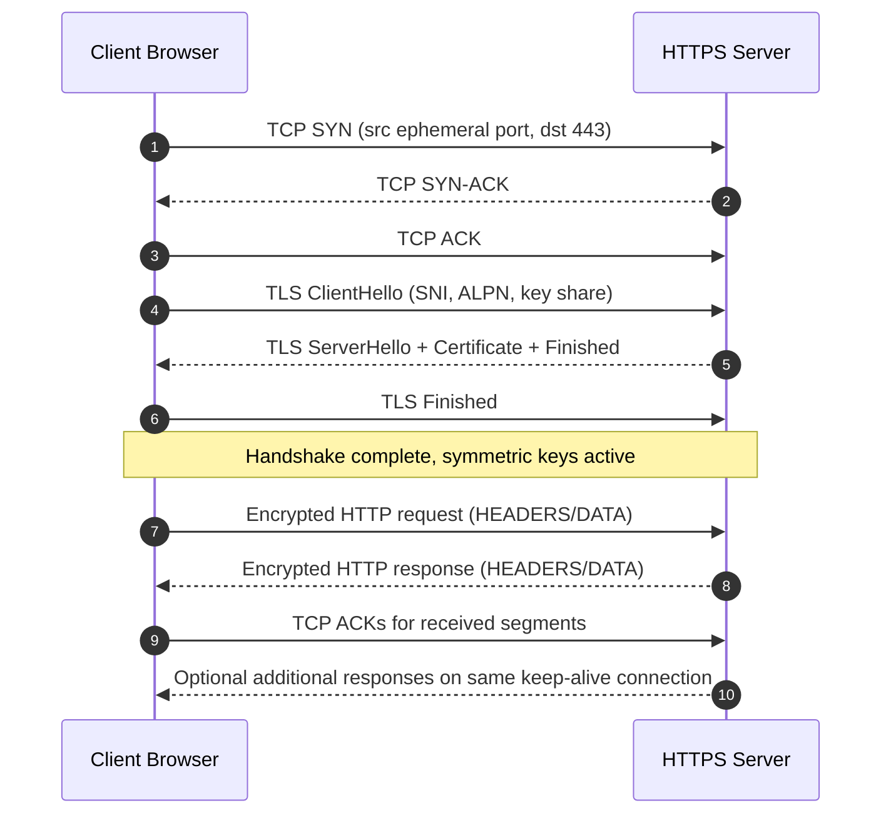
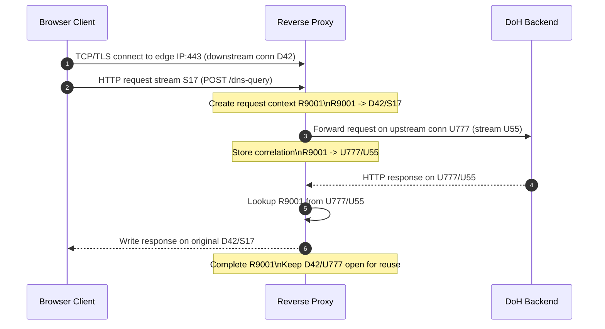
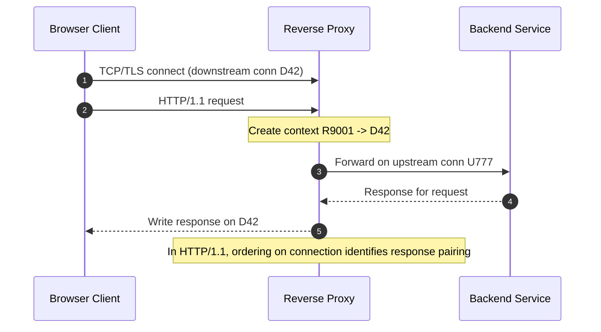

# DNS — Resolution Flow and Resolver Role

## What Is a DNS Resolver?

A DNS resolver is the component that answers "what is the IP (or other record) for this name?"

There are two common resolver roles:

- **Stub resolver** (on host/OS): minimal client that forwards queries.
- **Recursive resolver** (in network): performs full lookup by querying other nameservers and caching results.

When people say "DNS resolver" in production architecture, they usually mean the **recursive resolver**.

## End-to-End Resolution Flow

1. App asks OS for `www.example.com`.
2. OS checks local sources (browser cache, OS cache, `/etc/hosts`).
3. On miss, OS stub sends query to configured recursive resolver.
4. Recursive resolver checks its cache.
5. On miss, recursive resolver asks a root server for `.com` delegation.
6. Resolver asks `.com` TLD server for `example.com` delegation.
7. Resolver asks authoritative server for `www.example.com` record.
8. Authoritative server replies (e.g. CNAME -> A/AAAA chain).
9. Recursive resolver caches each RRset by TTL and returns final answer to client.

### Sequence Diagram

```text
Client/App
	|
	| query www.example.com
	v
OS Stub Resolver
	|
	| recursive query
	v
Recursive Resolver
	| cache miss
	+--> Root (.)          : where is .com?
	+<-- referral to TLD
	+--> .com TLD          : where is example.com?
	+<-- referral to auth NS
	+--> Authoritative NS  : A/AAAA for www.example.com?
	+<-- answer + TTL
	|
	+--> cache RRset
	v
Client gets final answer
```

### Architecture View

```text
									 [ Authoritative DNS Provider ]
																	|
										 iterative DNS|
																	v
[ Client Apps ] --recursive--> [ Recursive Resolver ]
			^                                |
			|                                | iterative referrals
			| local lookup order             v
[ OS Stub + hosts ]              Root -> TLD -> Auth
```

## Query Types: Recursive vs Iterative

- **Recursive query**: Client asks resolver "give me final answer".
- **Iterative query**: Resolver asks nameservers and gets referrals until it reaches authority.

### Why It Is Called a Recursive Resolver

The resolver is called "recursive" because of the service contract it offers to clients, not because every upstream hop is recursive.

- Stub/host sends query with recursion desired.
- Recursive resolver takes full responsibility for returning a final answer (or final error).
- Internally, that resolver usually performs iterative queries to root, TLD, and authoritative servers.

So both statements are true at once: client->resolver interaction is recursive; resolver->upstream interaction is usually iterative.

## How Browser Requests Reach a DNS Resolver

When a browser needs `www.example.com`, name resolution usually flows like this:

1. Browser asks OS networking APIs to resolve the hostname (for example, via `getaddrinfo`-style calls).
2. OS stub resolver checks local sources/caches and then queries configured recursive resolver(s).
3. Recursive resolver returns answer to OS, and OS returns it to the browser.

Who configures which recursive resolver is used?

- Commonly the OS/network stack via DHCP-provided DNS servers from router/ISP, or manual/enterprise policy settings.
- Not directly "the internet" deciding per request.
- Browser code initiates lookup, but resolver choice is typically owned by OS/network configuration.

Important exception: if browser DNS-over-HTTPS is enabled, browser may send DNS directly to its configured DoH provider instead of OS-configured UDP/TCP resolver path.

### Code Example: System Resolver Path

```python
import socket

hostname = "www.github.com"

# Uses the OS resolver path for address lookup.
results = socket.getaddrinfo(hostname, 443, proto=socket.IPPROTO_TCP)
ips = sorted({item[4][0] for item in results})

print(f"Resolved {hostname} to:")
for ip in ips:
	print(f"- {ip}")
```

## DNS Transport Options and Ownership

Traditional DNS and encrypted DNS modes are often discussed together; this section keeps them in one place.

- Classic DNS: UDP/53 by default, TCP/53 when needed.
- DoT: DNS inside TLS on TCP/853.
- DoH: DNS inside HTTPS on 443 (HTTP/2 or HTTP/3).

| Dimension | DoH | DoT |
|---|---|---|
| Transport | HTTPS (HTTP/2 or HTTP/3) | TLS over TCP |
| Typical port | 443 | 853 |
| Payload shape | DNS message inside HTTP request/response | Raw DNS message inside TLS stream |
| Visibility to middleboxes | Looks like general HTTPS traffic | Clearly DNS-over-TLS traffic |
| Browser adoption | Very common in modern browsers | Less common directly in browsers |
| Common use | Browser secure DNS, privacy over web path | OS/resolver-to-resolver encrypted DNS |

Resolver ownership model:

- Browser usually asks OS resolver APIs by default.
- OS/network policy chooses configured resolvers (DHCP/manual/VPN/enterprise policy).
- If browser DoH is enabled, browser may bypass classic OS DNS transport and use a DoH endpoint directly.

There is no single global "DoH registry". Browsers combine user settings, enterprise policy, vendor-maintained compatibility maps, and optional discovery metadata (such as DDR).

## Browser DNS Decision Flow

In practice, browser DNS selection is policy-first and fallback-safe:

1. Check explicit policy/user DoH settings.
2. If in automatic mode, map current system resolver(s) to a DoH candidate and/or discover one.
3. Probe and validate candidate endpoint over TLS.
4. Use DoH when healthy; otherwise fall back to OS DNS in automatic mode.
5. In strict mode, fail closed instead of falling back.

Most browsers implement DoH at browser layer. DoT selection is typically an OS/network concern when browser delegates to OS resolver APIs.

### Pseudo-Code: Browser DNS Path Selection

```javascript
async function resolveForNavigation(hostname) {
	const cached = browserDnsCache.get(hostname);
	if (cached && !cached.isExpired()) return cached.addresses;

	const dohMode = settings.secureDnsMode; // off | automatic | strict
	const dohEndpoint = settings.dohEndpoint;

	if (dohMode !== "off") {
		const canUseDoh = await dohPolicyAllows(hostname, dohEndpoint);
		if (canUseDoh) {
			try {
				const answer = await resolveViaDoh(hostname, dohEndpoint);
				browserDnsCache.put(hostname, answer.addresses, answer.ttlSeconds);
				return answer.addresses;
			} catch (err) {
				if (dohMode === "strict") throw new Error("DoH failed in strict mode");
			}
		}
	}

	// Fallback path: use OS resolver APIs.
	const osAnswer = await osResolverGetAddrInfo(hostname);
	browserDnsCache.put(hostname, osAnswer.addresses, osAnswer.ttlSeconds);
	return osAnswer.addresses;
}
```

### Pseudo-Code: How Browser Determines DoH Eligibility

```javascript
async function selectDnsTransport(hostname) {
	const mode = settings.secureDnsMode; // off | automatic | strict
	// Reads resolver IPs currently configured by OS/network stack
	// (typically DHCP, manual OS DNS settings, VPN, or enterprise policy).
	const systemResolvers = os.getConfiguredResolvers();

	// 1) Highest priority: explicit config/policy.
	if (policy.forcedDohEndpoint) {
		return { kind: "doh", endpoint: policy.forcedDohEndpoint };
	}
	if (mode === "off") {
		return { kind: "os" };
	}

	// 2) Compatibility map or discovery metadata.
	const mapped = browserResolverMap.lookup(systemResolvers);
	const discovered = await tryDesignatedResolverDiscovery(systemResolvers);
	const candidate = mapped ?? discovered;

	if (!candidate) {
		if (mode === "strict") throw new Error("No DoH candidate in strict mode");
		return { kind: "os" };
	}

	// 3) Runtime validation.
	const healthy = await probeDohEndpoint(candidate.endpoint);
	if (healthy) {
		return { kind: "doh", endpoint: candidate.endpoint };
	}

	if (mode === "strict") throw new Error("DoH probe failed in strict mode");
	return { kind: "os" };
}
```

### Bootstrap Behavior on First DoH Attempt

On first run, this is usually not a chicken-and-egg problem:

- Browsers often ship with a built-in resolver compatibility map for common providers.
- If mapping is unavailable, browser can attempt resolver discovery using current OS resolver path.
- Initial bootstrap queries may use OS DNS before switching to DoH.
- In `automatic` mode, no candidate or failed probe falls back to OS DNS.
- In `strict` mode, no candidate or failed probe causes resolution failure instead of fallback.

## Resolver Mapping, Discovery, and Endpoint Semantics

### Example: browserResolverMap Shape

This is a simplified conceptual example (not real browser production data):

```javascript
const browserResolverMap = {
	entries: [
		{
			match: {
				provider: "Example ISP DNS",
				resolverIps: ["203.0.113.53", "203.0.113.54"]
			},
			doh: {
				endpoint: "https://doh.example-isp.net/dns-query",
				template: "https://doh.example-isp.net/dns-query{?dns}"
			}
		},
		{
			match: {
				provider: "Public Resolver A",
				resolverIps: ["198.51.100.1", "198.51.100.2"]
			},
			doh: {
				endpoint: "https://resolver-a.example/dns-query",
				template: "https://resolver-a.example/dns-query{?dns}"
			}
		}
	],

	lookup(systemResolvers) {
		for (const entry of this.entries) {
			const hit = systemResolvers.some(r => entry.match.resolverIps.includes(r.ip));
			if (hit) return entry.doh;
		}
		return null;
	}
};
```

Matching keys can vary by browser implementation, for example resolver IP sets, provider fingerprints, network metadata, policy constraints, or region-specific rollout rules.

### Resolver IP vs DoH Endpoint: Why They Can Differ

These two fields serve different roles:

- `resolverIp` (from OS config) identifies the current classic DNS resolver service (usually UDP/TCP 53 path).
- DoH `endpoint` identifies the HTTPS service used for encrypted DNS transport.

They can be different because:

- Providers often run classic DNS and DoH on different edge tiers.
- DoH relies on hostname identity (TLS certificate + SNI), not just a raw IP.
- Endpoint hostnames commonly resolve to load balancer/Anycast edges that can change by region/time.

What `resolverIp` is used for in browser auto-upgrade:

- Signal/fingerprint to identify likely provider compatibility.
- Input to curated mapping or discovery logic.
- Fallback target when automatic DoH is unavailable.

### DDR-Style Designated Resolver Discovery (Via Resolver Path)

DDR means the client asks the currently configured resolver for its designated encrypted resolver information.

Typical flow:

1. Browser gets system resolver list from OS.
2. Browser sends discovery DNS queries over current resolver path.
3. Resolver returns designated encrypted resolver metadata (for example DoH/DoT service binding hints).
4. Browser builds candidate endpoint (for example `https://doh.provider.example/dns-query`).
5. Browser validates candidate with TLS hostname/certificate checks and runtime probing.
6. If valid, browser upgrades to DoH; if not, `automatic` falls back to OS DNS while `strict` fails closed.

### Example: DHCP Resolver to DoH Mapping Lifecycle

Example lifecycle on a new network:

1. DHCP provides resolver IPs `203.0.113.53` and `203.0.113.54`.
2. OS installs them as system resolvers.
3. Browser reads these and checks `browserResolverMap`.
4. Browser finds mapping to `https://doh.example-isp.net/dns-query` (or discovers it via DDR).
5. Browser resolves `doh.example-isp.net` and opens TCP/TLS to returned edge IP (often load balancer/Anycast).
6. Browser sends DoH HTTP request to `/dns-query` and receives DNS response.

Important: the TCP destination for DoH is the endpoint host's current resolved IP, which may be a load balancer edge and not the same literal IP as OS resolver configuration.

## DoH vs DoT Packet and TLS Flow

DoH flow (simplified):

1. Client -> DoH server: TCP/QUIC connect (usually 443).
2. TLS handshake + certificate validation.
3. HTTP request carrying DNS query bytes.
4. HTTP response carrying DNS answer bytes.

DoT flow (simplified):

1. Client -> DoT server: TCP connect on 853.
2. TLS handshake + certificate validation.
3. DNS query bytes over TLS stream (no HTTP layer).
4. DNS response bytes over TLS stream.

Certificate validation behavior is the same at a high level for both DoH and DoT: endpoint identity, certificate chain trust, validity period, and policy checks must pass before DNS data is exchanged.

## Modern Browser Default Behavior

Short answer: DoH is often enabled in automatic mode, not always strict mode.

- Compatible networks/providers: browser may auto-upgrade to DoH.
- Incompatible/unhealthy candidate: automatic mode falls back to system DNS.
- Strict mode: no fallback when DoH is required.

### Pseudo-Code: OS Delegation and Potential DoT Use

```javascript
async function resolveViaOs(hostname) {
	// Browser delegates to OS resolver API.
	const answer = await osResolverGetAddrInfo(hostname);

	// OS/network profile may use classic DNS, DoT, or OS-level DoH.
	return answer;
}
```

### Pseudo-Code: DoH Query and TLS Validation Flow

```javascript
async function resolveViaDoh(hostname, endpoint) {
	// TLS handshake happens during HTTPS connection setup.
	const queryWire = buildDnsWireQuery({ name: hostname, type: "A" });

	const resp = await fetch(endpoint, {
		method: "POST",
		headers: {
			"content-type": "application/dns-message",
			"accept": "application/dns-message"
		},
		body: queryWire
	});

	if (!resp.ok) throw new Error(`DoH failed: ${resp.status}`);

	const answerWire = new Uint8Array(await resp.arrayBuffer());
	return parseDnsWireResponse(answerWire);
}
```

## HTTPS Over TCP: Runtime Responsibilities

At a high level, HTTPS is HTTP carried inside TLS, and TLS is carried over TCP (or over QUIC for HTTP/3). For HTTP/1.1 and HTTP/2, the usual stack is:

`HTTP plaintext` -> `TLS records (encrypted)` -> `TCP segments` -> `IP packets` -> `Link frames`

Detailed sequence for HTTPS over TCP:

1. Application (browser) asks OS to create a socket (`socket`).
2. Application asks OS to connect TCP to remote IP:443 (`connect`).
3. OS TCP stack performs 3-way handshake (SYN, SYN-ACK, ACK).
4. After TCP is established, browser TLS stack sends `ClientHello` bytes on that socket.
5. Server replies with handshake messages including certificate chain.
6. Browser validates certificate and completes key exchange.
7. TLS session keys are installed in browser TLS state.
8. Browser writes HTTP request plaintext to TLS library.
9. TLS library encrypts and emits TLS records; OS sends ciphertext bytes via TCP/IP.
10. On receive path, OS delivers ciphertext bytes from socket to browser process; TLS library decrypts and returns plaintext HTTP response to browser networking code.

Who implements what:

- OS kernel: sockets API, TCP state machine, packet transmit/receive, congestion control.
- Browser/app TLS stack (or platform TLS library): handshake logic, certificate validation, key schedule, record encryption/decryption.
- Application protocol layer: HTTP semantics (methods, headers, bodies).

### Implementation Reality and Exceptions

In most browser deployments, the OS kernel does **not** parse HTTP or perform full TLS handshake logic on behalf of the browser. A more precise model is:

1. Kernel reliably owns IP/TCP transport and socket I/O.
2. TLS handshake and certificate validation are usually done in user space (browser TLS library or platform TLS API).
3. HTTP parsing is done by browser/networking code after plaintext is available to that process.

Common implementation patterns:

- Browser-managed TLS: browser ships/uses its own TLS stack and validates certs in process.
- Platform TLS API: browser/app calls OS security API from user space; still not "kernel gives parsed HTTP" by default.
- Kernel TLS/NIC offload (advanced path): kernel or hardware may handle record encryption/decryption after handshake secrets are provisioned.

Practical conclusion:

- "OS implements networking" is always true for IP/TCP transport.
- "OS decrypts and returns HTTP to browser" is only true in specific offload/integration paths, not the default assumption.

### Browser Implementation Examples

Concrete examples from common browser ecosystems:

- Chromium/Chrome family commonly uses BoringSSL as the TLS library in browser/runtime stack.
- Firefox uses NSS (Network Security Services) for TLS and certificate handling.

Why these examples matter:

- They illustrate that major browsers typically carry user-space TLS implementations.
- Kernel networking still provides socket/IP/TCP transport beneath those TLS stacks.
- Platform APIs and kernel/offload integrations may exist, but are treated as implementation choices, not universal defaults.

### Pseudo-Code: TLS Runtime Ownership Model

```python
def https_runtime_path(app, os_stack, conn):
	# Transport setup is always OS/kernel territory.
	sock = os_stack.tcp_connect(conn.remote_ip, 443)

	if app.uses_browser_tls_library:
		# Typical browser path: user-space TLS handshake and cert validation.
		tls_ctx = app.tls.handshake(sock, server_name=conn.host)
		app.tls.verify_certificate_chain(tls_ctx, expected_host=conn.host)
		return "userspace_tls_record_layer"

	if app.uses_platform_tls_api:
		# OS API may be used from user space, but app still owns HTTP semantics.
		tls_ctx = os_stack.platform_tls.handshake(sock, server_name=conn.host)
		return "platform_userspace_tls"

	if os_stack.ktls_enabled and app.provisions_session_keys:
		# Exception path: data record encryption/decryption can move into kernel/NIC.
		os_stack.ktls.install_tx_rx_keys(sock, conn.session_keys)
		return "kernel_or_nic_tls_datapath"

	return "implementation_specific"
```

## HTTPS Packet Format

For HTTP/2 over TLS over TCP, packets are conceptually layered as:

```text
L2 Frame
	L3: IP header
		L4: TCP header
			TLS record header + encrypted payload
				(inside decrypted payload: HTTP/2 frames)
```

Important note: OS does not usually deliver decrypted HTTPS to apps. It delivers socket bytes (ciphertext after TLS starts). Decryption is typically done in user-space TLS library inside browser/app process. After decryption, app sees plaintext HTTP messages.

### HTTPS Field Breakdown by Layer

The following fields are the most relevant attributes engineers inspect during debugging and packet analysis.

#### IP Header Fields (IPv4)

- Version: `4`
- IHL (header length)
- DSCP/ECN
- Total Length
- Identification
- Flags + Fragment Offset
- TTL
- Protocol (`6` for TCP)
- Header Checksum
- Source IP
- Destination IP

IPv6 has different base fields (`Traffic Class`, `Flow Label`, `Payload Length`, `Next Header`, `Hop Limit`, source/destination addresses) and extension headers.

#### TCP Header Fields

- Source Port
- Destination Port (`443` for HTTPS over TCP)
- Sequence Number
- Acknowledgment Number
- Data Offset
- Flags (`SYN`, `ACK`, `PSH`, `FIN`, `RST`, etc.)
- Window Size
- Checksum
- Urgent Pointer
- Options (common: MSS, Window Scale, SACK Permitted, Timestamps)

#### TLS Record Layer Fields

Each TLS record has:

- Content Type (Handshake, Application Data, Alert)
- Legacy Version field
- Record Length
- Encrypted payload (after handshake keys are active)

TLS 1.3 note: most post-handshake traffic appears as encrypted application data records on wire.

#### TLS Handshake Attributes (ClientHello/ServerHello)

Common ClientHello attributes:

- Supported Versions (for example TLS 1.3)
- Cipher Suites
- Extensions:
  - SNI (server name)
  - ALPN (`h2`, `http/1.1`)
  - Supported Groups (ECDHE groups)
  - Signature Algorithms
  - Key Share

Common server-side handshake attributes:

- Chosen TLS version
- Chosen cipher suite
- Certificate chain
- Key share response
- Finished message proving key agreement

#### HTTP/1.1 Request Fields (Inside TLS)

```text
GET /products?id=42 HTTP/1.1
Host: www.example.com
User-Agent: ExampleBrowser/1.0
Accept: text/html,application/xhtml+xml
Accept-Encoding: gzip, br
Connection: keep-alive
Cookie: session=abc123

```

Key request attributes:

- Method (`GET`, `POST`, etc.)
- Target (`/path?query`)
- Version (`HTTP/1.1`)
- Host header (required in HTTP/1.1)
- Request headers (content negotiation, auth, caching, cookies)
- Optional body (for example JSON form payload)

#### HTTP/1.1 Response Fields (Inside TLS)

```text
HTTP/1.1 200 OK
Date: Thu, 28 May 2026 10:00:00 GMT
Content-Type: text/html; charset=utf-8
Content-Length: 1256
Cache-Control: max-age=60
Set-Cookie: session=def456; Secure; HttpOnly; SameSite=Lax

<html>...</html>
```

Key response attributes:

- Status line (version, status code, reason phrase)
- Response headers (type, cache, cookies, security headers)
- Optional body bytes

#### HTTP/2 Frame Structure (Inside TLS)

HTTP/2 transports messages as frames on streams.

Frame header (9 bytes):

- Length (24 bits)
- Type (for example `HEADERS`, `DATA`, `SETTINGS`, `WINDOW_UPDATE`)
- Flags
- Stream Identifier (31 bits)

Important HTTP/2 request attributes:

- Pseudo-headers: `:method`, `:scheme`, `:authority`, `:path`
- Regular headers (compressed with HPACK)
- Stream ID identifying request/response pair

Important HTTP/2 response attributes:

- `:status` pseudo-header (for example `200`)
- Response headers in `HEADERS` frame
- Optional body in `DATA` frames
- End of stream flag to mark completion

### Examples: DNS-Focused HTTPS (DoH)

The examples below show HTTPS fields specifically for DNS-over-HTTPS traffic.

#### DoH HTTP/2 POST Request Example

```text
:method: POST
:scheme: https
:authority: doh.example.net
:path: /dns-query
content-type: application/dns-message
accept: application/dns-message
content-length: 33
```

Meaning of important fields:

- `:authority`: DoH virtual host identity used with TLS SNI/certificate.
- `:path`: DoH application endpoint (`/dns-query`).
- `content-type`: body contains binary DNS wire-format message.
- `accept`: client expects DNS wire-format response body.

#### DoH HTTP/2 GET Request Example

```text
:method: GET
:scheme: https
:authority: doh.example.net
:path: /dns-query?dns=AAABAAABAAAAAAAAA3d3dwdleGFtcGxlA2NvbQAAAQAB
accept: application/dns-message
```

Notes:

- `dns=` query value is base64url-encoded DNS wire query.
- GET is common for cache-friendly resolver deployments; POST is common for larger or simpler binary handling.

#### DoH HTTP Response Example

```text
:status: 200
content-type: application/dns-message
cache-control: max-age=300
content-length: 49
```

Meaning of important fields:

- `:status=200` indicates HTTP transport success (DNS result still in body `RCODE`).
- `content-type` confirms response body is DNS wire bytes.
- `cache-control` is HTTP-layer cache metadata; DNS TTL in body still governs DNS semantics.

#### DNS Wire Fields Inside DoH Body (Example Query/Answer)

Query body (conceptual values):

- `ID`: `0x4a3f`
- `Flags`: `RD=1`
- `QDCOUNT`: `1`
- `Question`: `QNAME=www.example.com`, `QTYPE=A`, `QCLASS=IN`

Response body (conceptual values):

- `ID`: `0x4a3f` (matches query)
- `Flags`: `QR=1`, `RA=1`, `RCODE=0`
- `ANCOUNT`: `1`
- `Answer`: `NAME=www.example.com`, `TYPE=A`, `TTL=300`, `RDATA=93.184.216.34`

Interpretation rule:

- HTTP status reports DoH transport success/failure.
- DNS header (`RCODE`, answer counts, TTL, records) reports DNS lookup result.

### Detailed HTTPS Exchange Sequence



### Packet View of One HTTPS Request/Response

```text
Client -> Server
IP(src=client,dst=server)
TCP(src=53144,dst=443,seq=1001,ack=5001,flags=PSH,ACK)
TLS(record=ApplicationData,len=...)
HTTP(payload=request headers/body)

Server -> Client
IP(src=server,dst=client)
TCP(src=443,dst=53144,seq=5001,ack=...,flags=PSH,ACK)
TLS(record=ApplicationData,len=...)
HTTP(payload=response headers/body)
```

Notes:

- Packet boundaries and HTTP message boundaries are not the same. One HTTP message may span many TLS records and TCP segments.
- TCP provides ordered byte stream delivery; TLS and HTTP parse those bytes into higher-layer records/messages.
- With HTTP/2, multiple streams can be interleaved on the same TCP connection.

### TLS 1.3 Handshake Transcript

This table summarizes the common full handshake path (without client certificate authentication).

| Order | Sender | Handshake Message | Main Attributes | Security Contribution |
|---|---|---|---|---|
| 1 | Client | ClientHello | `supported_versions`, `cipher_suites`, `key_share`, `signature_algorithms`, `server_name` (SNI), `alpn` | Proposes capabilities and ephemeral key share; identifies intended hostname; starts key agreement. |
| 2 | Server | ServerHello | selected version/cipher, server `key_share` | Selects final crypto parameters and completes ECDHE shared-secret derivation. |
| 3 | Server | EncryptedExtensions | negotiated ALPN and extension outcomes | Moves extension negotiation under encryption; confirms protocol details. |
| 4 | Server | Certificate | certificate chain for server identity | Provides identity material for authentication (PKI chain). |
| 5 | Server | CertificateVerify | signature over handshake transcript | Proves possession of private key corresponding to certificate. |
| 6 | Server | Finished | MAC over transcript with handshake traffic keys | Cryptographically commits server handshake state integrity. |
| 7 | Client | Finished | MAC over transcript with handshake traffic keys | Confirms client handshake state and key agreement completion. |
| 8 | Both | Application Data | encrypted HTTP bytes in TLS records | Secure channel active: confidentiality + integrity for request/response traffic. |

Important details:

- In TLS 1.3, most handshake messages after `ServerHello` are encrypted.
- The certificate is transmitted in the handshake, but protected after handshake keys are available.
- Perfect forward secrecy is provided by ephemeral key exchange (`key_share` / ECDHE).
- Session resumption can use PSK tickets to reduce latency on later connections.

## Mapping HTTPS Internals to DoH

DoH reuses the same HTTPS/TLS/TCP machinery and changes only the application payload semantics.

- Regular HTTPS: HTTP payload carries web/app content.
- DoH HTTPS: HTTP payload carries DNS wire-format query/response bytes.

Use the following blocks in this order:

1. Pseudocode for browser/runtime behavior.
2. End-to-end resolution flow.
3. Reverse-proxy demultiplexing and response correlation.
4. DoH wire/message field layout.

### Pseudo-Code: HTTPS Over TCP Socket Lifecycle

```python
def https_request(hostname: str, ip: str, request_bytes: bytes) -> bytes:
	# 1) Open TCP socket via OS networking stack.
	sock = os_socket(AF_INET, SOCK_STREAM)
	os_connect(sock, (ip, 443))

	# 2) Wrap socket with TLS context in user-space (or platform TLS library).
	tls = tls_context(server_name=hostname, verify_cert=True)
	tls_conn = tls.wrap_socket(sock)

	# 3) TLS handshake exchanges certificates and session keys.
	tls_conn.handshake()

	# 4) App writes plaintext HTTP; TLS emits encrypted records.
	tls_conn.write(request_bytes)

	# 5) OS returns encrypted socket bytes; TLS decrypts before app reads.
	response_plaintext = tls_conn.read_all()
	return response_plaintext
```

### Pseudo-Code: Browser Navigation with DoH + HTTPS

```python
def navigate(url: str):
	host = parse_host(url)

	# DNS phase
	if browser_settings.secure_dns_mode in ("automatic", "strict"):
		dns_answer = resolve_via_doh(host)
	else:
		dns_answer = os_getaddrinfo(host)

	target_ip = happy_eyeballs_select(dns_answer.addresses)

	# Content phase: separate HTTPS session to website origin.
	req = build_http_get(url)
	page = https_request(host, target_ip, req)
	return page
```

### Packet Flow: HTTPS and DoH Side-by-Side

```text
HTTPS to website (content):
Browser app data: HTTP request
	-> TLS record encrypt
		-> TCP segment
			-> IP packet
				-> network

DoH to resolver (DNS):
Browser app data: DNS wire query in HTTP body
	-> TLS record encrypt
		-> TCP segment (or QUIC datagram for HTTP/3)
			-> IP packet
				-> network
```

### What OS Delivers to Browser Process

```text
Before TLS starts:
- OS socket recv returns plaintext TLS handshake bytes from peer.

After TLS starts (typical user-space TLS):
- OS socket recv returns encrypted TLS records.
- TLS library in browser decrypts and returns plaintext HTTP bytes to app code.
```

## Browser DoH Resolution Flow

When browser-side DoH is active, lookup and page load usually follow this sequence:

1. User enters `https://www.example.com`.
2. Browser checks local caches (host cache, DNS cache, preconnect/prefetch state).
3. Browser sends DoH query for A/AAAA to configured DoH endpoint.
4. DoH endpoint's recursive resolver performs iterative lookup if cache miss.
5. DoH response returns answer and TTL to browser.
6. Browser chooses target IP candidate(s) (IPv6/IPv4 policy such as Happy Eyeballs).
7. Browser connects to target IP and starts HTTPS handshake with target website.
8. Website certificate exchange happens separately from DoH certificate exchange.
9. HTTP request/response for page content proceeds after website TLS is established.

Two separate TLS contexts exist and should be reasoned about independently:

- TLS session A: browser <-> DoH server (for DNS transport privacy)
- TLS session B: browser <-> website origin (for application content security)

## Reverse Proxy Demultiplexing and Response Correlation

Many HTTPS services (including DoH) can share one public IP:443. Reverse proxy logic first demultiplexes requests, then correlates upstream replies back to the correct downstream connection/stream.

Demultiplexing path:

1. TCP accept on shared listener (for example `198.51.100.20:443`).
2. TLS handshake reads SNI to choose virtual certificate/site context.
3. ALPN selects HTTP protocol (`h2`, `http/1.1`, or HTTP/3 stack).
4. HTTP routing uses host/authority + path (for example `/dns-query`) to choose backend service.

How proxy maps backend response to correct client socket:

1. Client request is parsed on downstream connection/stream.
2. Proxy creates request context with IDs such as:
	 - downstream connection ID
	 - downstream stream ID (HTTP/2 or HTTP/3)
	 - selected upstream connection/stream
3. Proxy forwards request upstream and stores correlation map.
4. Backend response arrives on upstream connection/stream.
5. Proxy looks up correlation map and writes response to original downstream connection/stream.
6. Context is cleaned up after response completion; sockets may remain open for reuse.

Important nuance:

- Response returns on the same browser<->proxy TCP socket (or QUIC connection) used by the request.
- Proxy<->backend usually uses a different internal connection.

### Sequence Diagram: Downstream and Upstream Correlation



### Sequence Diagram: HTTP/1.1 Variant (No Stream IDs)



## DoH Message and Packet Format

This section is the wire-level reference for DoH payload structure.

On-wire layering (HTTP/1.1 or HTTP/2 over TLS over TCP):

```text
L2 frame
	IP header
		TCP header (dst port 443)
			TLS record (encrypted)
				HTTP headers + body
					DNS wire message bytes
```

### Fields: DoH Request

HTTP request (conceptual):

```text
POST /dns-query HTTP/2
:authority: doh.example.net
content-type: application/dns-message
accept: application/dns-message
[body = DNS wire query bytes]
```

Field meanings:

- Host or `:authority`: identifies virtual HTTPS service at shared IP:443.
- Path (`/dns-query`): routes to DoH handler.
- `content-type: application/dns-message`: payload is raw DNS wire format.
- `accept: application/dns-message`: client expects raw DNS wire response.

### Fields: DNS Wire Payload Inside DoH Body

Request payload typically includes:

- Header (12 bytes): `ID`, flags (`RD` etc.), counts (`QDCOUNT`, ...)
- Question: `QNAME`, `QTYPE` (A/AAAA/etc.), `QCLASS` (IN)

Response payload typically includes:

- Header with `QR=1`, `RCODE`, counts (`ANCOUNT`, ...)
- Question echo
- Answer records with `TTL` and `RDATA`
- Optional authority/additional records

### Fields: DoH Response

```text
HTTP/2 200
content-type: application/dns-message
[body = DNS wire response bytes]
```

Notes:

- The DoH endpoint host is service identity for TLS/SNI and HTTP routing.
- The endpoint host can resolve to load balancer or Anycast edge IPs.
- Multiple applications can coexist on same IP:443 because demultiplexing occurs at TLS and HTTP layers.

## UDP vs TCP in DNS

UDP characteristics:

- Default for most DNS lookups due to low overhead and latency.
- One request/one response datagram model.
- No transport-level retransmission; retries/timeouts handled by DNS client logic.

TCP characteristics:

- Used when response is too large for acceptable UDP path limits and server sets truncation (`TC=1`).
- Required for AXFR/IXFR zone transfer operations.
- Useful when middleboxes fragment/drop UDP, or for stricter delivery semantics.

Typical resolver behavior:

- Try UDP first for normal queries.
- If truncated or policy requires, retry same query over TCP.

## How DNS Packets Look

Classic DNS message format (RFC-style wire layout):

```text
Header (12 bytes)
- ID
- Flags (QR, OPCODE, AA, TC, RD, RA, RCODE...)
- QDCOUNT, ANCOUNT, NSCOUNT, ARCOUNT

Question section
- QNAME, QTYPE, QCLASS

Answer section(s)
- NAME, TYPE, CLASS, TTL, RDLENGTH, RDATA

Authority section
- Usually NS/SOA data for referrals or negative answers

Additional section
- Extra helpful RRs (for example glue A/AAAA, OPT for EDNS)
```

Transport framing differences:

- UDP: exactly one DNS message per datagram.
- TCP: each DNS message is prefixed with a 2-byte length field on the stream.
- DoH: DNS message is payload inside HTTP over TLS, so HTTP and TLS frames carry it on the wire.

## Useful Commands for This Chapter

```bash
# Local resolver configuration (macOS)
scutil --dns

# Follow full delegation path
dig +trace example.com A

# Show only final answers
dig www.github.com A +noall +answer

# Reverse lookup
dig -x 8.8.8.8 +noall +answer

# Force TCP instead of UDP
dig example.com A +tcp

# Show if UDP response was truncated (look for "tc" flag)
dig dnssec-failed.org DNSKEY +dnssec

# Query a DoH endpoint over HTTPS
curl -sS -H 'accept: application/dns-json' \
	'https://dns.google/resolve?name=example.com&type=A'
```

## Why Recursive Resolvers Are Critical

- Reduce latency through shared cache hits.
- Protect authoritative servers from repeated traffic.
- Apply policy/security (DNSSEC validation, filtering, split-horizon rules).
- Improve resilience using retries and alternate upstream paths.

## Failure Scenarios to Understand

- Resolver unavailable: apps fail to resolve names quickly.
- Stale cache after change: traffic may continue to old endpoint until TTL expiry.
- Bad delegation (NS/glue mismatch): domain partially or fully unresolvable.

---

**Navigation:**
- [<- Previous: Introduction](01-introduction.md)
- [Back to Index](README.md)
- [Next: Record Types and Format ->](03-record-types-and-format.md)
