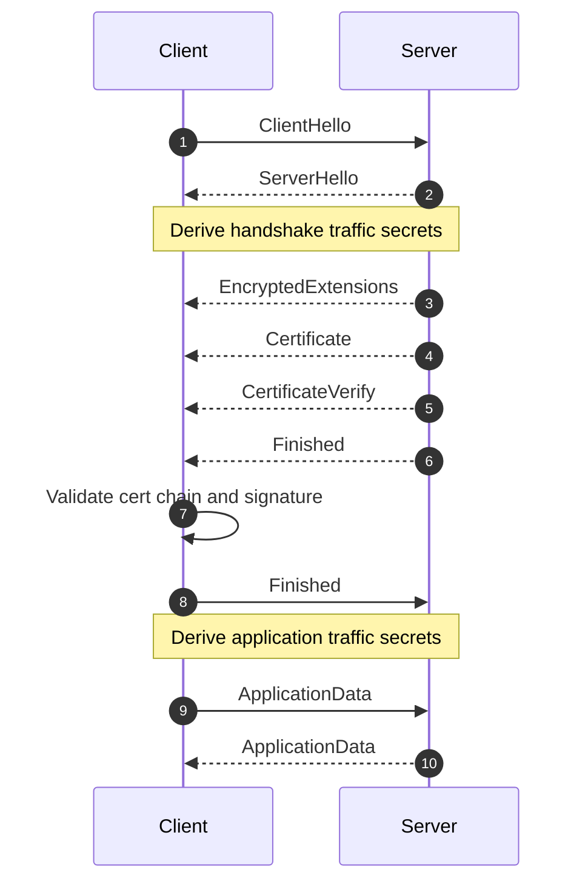

# TLS — TLS 1.3 Handshake Transcript

This chapter is a message-level deep dive into TLS 1.3 handshake behavior, attributes, validation rules, and key transitions.

## Mental Model

TLS 1.3 does three jobs during handshake:

1. Negotiates protocol and cryptographic parameters.
2. Authenticates endpoint identity (usually server identity).
3. Derives symmetric keys for encrypted application data.

## Handshake Timeline (No Client Certificate)

| Order | Sender | Message | Primary Purpose |
|---|---|---|---|
| 1 | Client | ClientHello | Offer versions, ciphers, key shares, extensions. |
| 2 | Server | ServerHello | Select final parameters and complete ECDHE agreement. |
| 3 | Server | EncryptedExtensions | Confirm negotiated extension outcomes under encryption. |
| 4 | Server | Certificate | Provide certificate chain. |
| 5 | Server | CertificateVerify | Prove private-key possession. |
| 6 | Server | Finished | Bind transcript integrity with handshake keys. |
| 7 | Client | Finished | Confirm client transcript integrity. |
| 8 | Both | ApplicationData | Exchange encrypted app traffic using application traffic keys. |

## Full Sequence Diagram



## Step 0: Client Handshake Initialization

### Key Attributes Decided Before First Byte

- Expected server name (for SNI and hostname verification).
- Trust store / policy (public roots, enterprise roots, pinning, revocation policy).
- ALPN preference order (for example `h2`, `http/1.1`).
- Supported TLS versions and cipher suites.
- Supported signature schemes and ECDHE groups.

### Pseudo-Code: Initialize Handshake Context

```python
def init_tls_context(server_name: str):
    ctx = TLSContext()
    ctx.server_name = server_name
    ctx.supported_versions = ["TLS1.3"]
    ctx.cipher_suites = [
        "TLS_AES_128_GCM_SHA256",
        "TLS_AES_256_GCM_SHA384",
        "TLS_CHACHA20_POLY1305_SHA256",
    ]
    ctx.supported_groups = ["x25519", "secp256r1"]
    ctx.signature_algorithms = ["rsa_pss_rsae_sha256", "ecdsa_secp256r1_sha256"]
    ctx.alpn = ["h2", "http/1.1"]
    ctx.trust_store = load_system_or_app_trust_roots()
    return ctx
```

## Step 1: ClientHello

### Message Attributes

- `legacy_version`: compatibility field (real version in extensions).
- `random`: client random.
- `cipher_suites`: ordered preference list.
- `key_share`: one or more ephemeral public keys.
- `supported_versions`: includes TLS 1.3.
- `signature_algorithms`: accepted cert-signature algorithms.
- `server_name` (SNI): target hostname.
- `alpn`: desired application protocols.
- Optional: PSK binders for resumption.

### Pseudo-Code: Build and Send ClientHello

```python
def send_client_hello(conn, ctx):
    ch = ClientHello()
    ch.random = random_bytes(32)
    ch.cipher_suites = ctx.cipher_suites
    ch.extensions["supported_versions"] = ctx.supported_versions
    ch.extensions["key_share"] = build_client_key_shares(ctx.supported_groups)
    ch.extensions["signature_algorithms"] = ctx.signature_algorithms
    ch.extensions["server_name"] = ctx.server_name
    ch.extensions["alpn"] = ctx.alpn
    conn.send(ch.serialize())
    return ch
```

## Step 2: ServerHello

### Message Attributes

- Selected TLS version.
- Selected cipher suite.
- Selected key share (ECDHE response).
- Optional selected PSK identity (resumption path).

### Security Effect

- Both sides can compute shared ECDHE secret.
- Handshake traffic secrets become derivable.

### Pseudo-Code: Receive ServerHello and Derive Handshake Secrets

```python
def recv_server_hello_and_derive_hs(conn, ctx, ch):
    sh = ServerHello.parse(conn.recv())
    assert sh.selected_version == "TLS1.3"
    assert sh.cipher_suite in ctx.cipher_suites

    ecdhe_secret = ecdhe_shared_secret(
        client_private_key=ch.find_private_for_group(sh.key_share.group),
        server_public_key=sh.key_share.public_key,
    )
    hs_keys = derive_handshake_traffic_keys(ch, sh, ecdhe_secret)
    return sh, hs_keys
```

## Step 3: EncryptedExtensions

### Message Attributes

- Negotiated ALPN value.
- Negotiated extension outputs (for example server-side constraints).

### Pseudo-Code: Process EncryptedExtensions

```python
def process_encrypted_extensions(conn, hs_keys):
    ee_bytes = conn.recv_decrypt(hs_keys.server_read_key)
    ee = EncryptedExtensions.parse(ee_bytes)
    selected_alpn = ee.extensions.get("alpn")
    return ee, selected_alpn
```

## Step 4: Certificate

### Message Attributes

- Certificate chain (leaf + intermediates, sometimes stapled data/extensions).
- Extensions bound to certificate message context.

### Validation Checks

- Chain builds to trusted root.
- Validity period and key usage are acceptable.
- SAN/CN hostname matches expected server name.
- Revocation/policy checks per runtime policy.

### Pseudo-Code: Validate Certificate Chain

```python
def validate_server_certificate(cert_msg, server_name, trust_store):
    chain = cert_msg.certificate_chain
    path = build_certificate_path(chain, trust_store)
    verify_time_validity(path)
    verify_key_usage_and_policies(path)
    verify_hostname(path.leaf, expected_host=server_name)
    verify_revocation_if_enabled(path)
    return path
```

## Step 5: CertificateVerify

### Message Attributes

- Signature algorithm chosen by server.
- Signature over transcript hash with TLS-specific context string.

### Security Effect

- Proves server controls private key for leaf certificate.

### Pseudo-Code: Verify CertificateVerify

```python
def verify_certificate_verify(cv_msg, transcript_hash, leaf_public_key):
    signed_context = build_tls13_certverify_context(transcript_hash, role="server")
    verify_signature(
        public_key=leaf_public_key,
        algorithm=cv_msg.algorithm,
        message=signed_context,
        signature=cv_msg.signature,
    )
```

## Step 6: Server Finished

### Message Attributes

- HMAC over transcript using server finished key.

### Security Effect

- Commits all handshake bytes seen so far.
- Detects transcript tampering.

### Pseudo-Code: Verify Server Finished

```python
def verify_server_finished(fin_msg, transcript_hash, hs_keys):
    expected = hmac_finished(
        base_key=hs_keys.server_finished_key,
        transcript_hash=transcript_hash,
    )
    constant_time_equal(fin_msg.verify_data, expected)
```

## Step 7: Client Finished

### Message Attributes

- HMAC over transcript using client finished key.

### Pseudo-Code: Build and Send Client Finished

```python
def send_client_finished(conn, transcript_hash, hs_keys):
    verify_data = hmac_finished(
        base_key=hs_keys.client_finished_key,
        transcript_hash=transcript_hash,
    )
    fin = Finished(verify_data=verify_data)
    conn.send_encrypt(fin.serialize(), hs_keys.client_write_key)
```

## Step 8: Application Traffic Keys and Data

### Message Attributes

- Encrypted TLS records containing application payload bytes.
- Record protection via AEAD keys and nonces.

### Pseudo-Code: Transition to Application Data

```python
def switch_to_application_data(ch, sh, hs_keys):
    app_keys = derive_application_traffic_keys(ch, sh, hs_keys)
    state = {
        "read_key": app_keys.server_app_read_key,
        "write_key": app_keys.client_app_write_key,
    }
    return state
```

## End-to-End Pseudo-Code: Full Handshake Driver

```python
def tls13_handshake(conn, server_name):
    ctx = init_tls_context(server_name)

    ch = send_client_hello(conn, ctx)
    sh, hs_keys = recv_server_hello_and_derive_hs(conn, ctx, ch)

    ee, selected_alpn = process_encrypted_extensions(conn, hs_keys)
    cert_msg = Certificate.parse(conn.recv_decrypt(hs_keys.server_read_key))
    cv_msg = CertificateVerify.parse(conn.recv_decrypt(hs_keys.server_read_key))
    fin_msg = Finished.parse(conn.recv_decrypt(hs_keys.server_read_key))

    path = validate_server_certificate(cert_msg, server_name, ctx.trust_store)
    transcript_hash = compute_transcript_hash(ch, sh, ee, cert_msg, cv_msg)
    verify_certificate_verify(cv_msg, transcript_hash, path.leaf.public_key)
    verify_server_finished(fin_msg, transcript_hash, hs_keys)

    transcript_hash = update_transcript_hash(transcript_hash, fin_msg)
    send_client_finished(conn, transcript_hash, hs_keys)

    return switch_to_application_data(ch, sh, hs_keys)
```

## Optional Handshake Paths (Important in Production)

### HelloRetryRequest Path

- Used when server needs a different key-share group.
- Client sends second ClientHello with requested group.

```python
def maybe_handle_hrr(sh_or_hrr, conn, ctx):
    if sh_or_hrr.is_hello_retry_request:
        ch2 = rebuild_client_hello_with_requested_group(ctx, sh_or_hrr.requested_group)
        conn.send(ch2.serialize())
        return conn.recv_server_hello()
    return sh_or_hrr
```

### Client Authentication Path

- Server sends `CertificateRequest`.
- Client sends `Certificate` + `CertificateVerify` + `Finished`.

```python
def maybe_send_client_certificate(conn, hs_keys, client_identity):
    if server_requested_client_auth(conn, hs_keys):
        cert_msg = build_client_certificate(client_identity.cert_chain)
        cv_msg = build_client_certificate_verify(client_identity.private_key)
        conn.send_encrypt(cert_msg.serialize(), hs_keys.client_write_key)
        conn.send_encrypt(cv_msg.serialize(), hs_keys.client_write_key)
```

### Session Resumption (PSK) Path

- Prior connection ticket enables reduced handshake cost.

```python
def attach_resumption_psk(ch, session_ticket):
    if session_ticket and session_ticket.is_valid():
        ch.extensions["pre_shared_key"] = build_psk_extension(session_ticket)
        ch.extensions["psk_key_exchange_modes"] = ["psk_dhe_ke"]
```

### KeyUpdate During Long Connections

- Rotates traffic keys without full renegotiation.

```python
def handle_key_update(conn, app_state):
    ku = maybe_recv_key_update(conn, app_state["read_key"])
    if ku:
        app_state["read_key"] = derive_next_traffic_key(app_state["read_key"])
```

## Operational Debug Checklist

When a handshake fails, isolate by stage:

1. `ClientHello` mismatch: version/cipher/group/ALPN policy mismatch.
2. Certificate stage: chain/hostname/trust/revocation errors.
3. `Finished` failure: transcript mismatch or key schedule bug.
4. Post-handshake failures: record protection/key update/session ticket issues.

---

**Navigation:**
- [<- Previous: Introduction](01-introduction.md)
- [Back to Index](README.md)
- [Next: TLS Record Layer and Packet Mapping ->](03-record-layer-and-packet-mapping.md)
