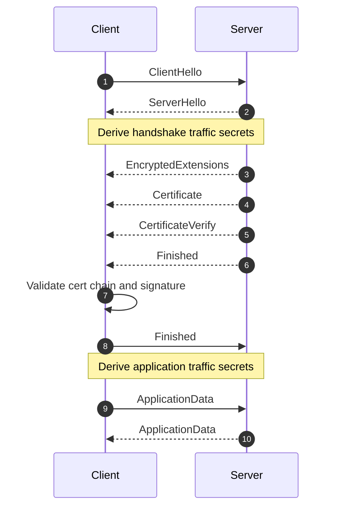

# TLS — TLS 1.3 Handshake Transcript

This chapter is a message-level deep dive into TLS 1.3 handshake behavior, attributes, validation rules, and key transitions.

## Mental Model

TLS 1.3 does three jobs during handshake:

1. Negotiates protocol and cryptographic parameters.
2. Authenticates endpoint identity (usually server identity).
3. Derives symmetric keys for encrypted application data.

The easiest way to reason about TLS 1.3 is to separate four questions:

1. What bytes are sent in each handshake message?
2. What security decision is each message enabling?
3. What state does each side derive after receiving that message?
4. Which later failures can be traced back to a mistake in that stage?

## Key Schedule Overview

TLS 1.3 uses HKDF to derive successive secrets from a small number of core inputs.

## What Are Symmetric Keys?

Symmetric keys are secret byte strings that both peers know and use for the same cryptographic operation family.

In TLS, they are used for:

- encrypting plaintext into ciphertext
- decrypting ciphertext back into plaintext
- authenticating records so tampering is detected
- deriving per-record nonces and related traffic-protection state

Why they are called symmetric:

- unlike asymmetric cryptography, there is no public/private key pair for record protection
- both sides end up with corresponding traffic secrets and derived keys for each direction

Important nuance:

- TLS does **not** use one single shared key for everything
- it derives separate keys per direction and per phase

Typical directional split:

- client write key: used to encrypt records sent by client
- server read key: used by server to decrypt those same records
- server write key: used to encrypt records sent by server
- client read key: used by client to decrypt those same records

So the keys are symmetric for the communicating pair, but directional in usage.

At a high level, the flow is:

1. Start from an initial secret (or PSK if resuming).
2. Mix in ECDHE shared secret.
3. Derive handshake traffic secrets.
4. Derive finished keys.
5. Derive application traffic secrets.
6. Optionally derive resumption secrets/tickets.

### What Inputs Generate the Symmetric Keys?

The critical inputs are:

1. PSK or zero input for initial stage
2. ECDHE shared secret from `key_share`
3. Transcript hashes of handshake bytes
4. Hash function selected by the negotiated cipher suite

This means the symmetric traffic keys are not randomly chosen in isolation; they are deterministically derived from handshake inputs and shared secrets.

### Clarification: "PSK or Zero Input" Means

- If session resumption/external PSK is used, the key schedule starts from that PSK material.
- If no PSK is used (normal full handshake), the schedule uses a zero-value placeholder at the earliest stage.
- This does **not** mean final traffic keys are zero; ECDHE and transcript inputs are mixed in next and produce real traffic secrets.

### Clarification: Is ECDHE the Shared Secret?

- ECDHE is the key-agreement method, not the final shared secret value itself.
- Client and server exchange ephemeral public keys.
- Each side computes the same ECDHE shared secret locally from its own ephemeral private key and the peer's ephemeral public key.

Conceptually:

- client computes `ECDH(c_priv, s_pub)`
- server computes `ECDH(s_priv, c_pub)`
- both results match and feed the TLS key schedule

### Clarification: What "Ephemeral Per Connection" Means

- Each handshake uses fresh temporary ECDHE key pairs.
- Those ECDHE private keys are not long-term identity keys.
- A new connection generally means new ECDHE key material and a new shared secret.

### Clarification: If Server Certificate Private Key Leaks, Can Old TLS 1.3 Traffic Be Decrypted?

Usually no, if forward secrecy conditions hold.

- Leaked certificate private key is a long-term identity key.
- Past session traffic keys came from ephemeral ECDHE shared secrets.
- Without the session-specific ephemeral ECDHE private keys (or exported session secrets), previously captured traffic remains protected.

Cases where old captures may become decryptable:

- session secrets/key logs were exposed
- ephemeral private keys were compromised from process memory
- non-forward-secret key exchange mode was used (not normal TLS 1.3 ECDHE path)

Conceptual derivation chain:

```text
early_secret
  -> handshake_secret = HKDF-Extract(early_secret, ecdhe_secret)
  -> client_handshake_traffic_secret
  -> server_handshake_traffic_secret
  -> client_finished_key / server_finished_key
  -> master_secret
  -> client_application_traffic_secret_0
  -> server_application_traffic_secret_0
  -> exporter_secret / resumption_master_secret
```

### How This Leads to Actual Encryption Keys

From traffic secrets, TLS derives concrete record-layer materials such as:

- AEAD write key
- AEAD read key
- static write IV
- static read IV
- finished keys

Conceptual expansion:

```text
client_application_traffic_secret_0
    -> client_write_key
    -> client_write_iv

server_application_traffic_secret_0
    -> server_write_key
    -> server_write_iv
```

### Pseudo-Code: HKDF-Style Key Schedule

```python
def derive_tls13_secrets(psk, ecdhe_secret, transcript_hashes):
    early_secret = hkdf_extract(salt=zeros(), ikm=psk or zeros())
    handshake_secret = hkdf_extract(
        salt=derive_secret(early_secret, "derived", empty_hash()),
        ikm=ecdhe_secret,
    )

    client_hs = derive_secret(handshake_secret, "c hs traffic", transcript_hashes["server_hello"])
    server_hs = derive_secret(handshake_secret, "s hs traffic", transcript_hashes["server_hello"])

    master_secret = hkdf_extract(
        salt=derive_secret(handshake_secret, "derived", empty_hash()),
        ikm=zeros(),
    )

    client_app = derive_secret(master_secret, "c ap traffic", transcript_hashes["finished"])
    server_app = derive_secret(master_secret, "s ap traffic", transcript_hashes["finished"])
    return client_hs, server_hs, client_app, server_app
```

### Pseudo-Code: Derive Concrete Traffic Keys from Traffic Secret

```python
def derive_record_protection_keys(traffic_secret, key_len, iv_len):
    write_key = hkdf_expand_label(traffic_secret, "key", b"", key_len)
    write_iv = hkdf_expand_label(traffic_secret, "iv", b"", iv_len)
    return write_key, write_iv
```

### C-Style Pseudo-Code: Conceptual Traffic-Key Derivation

```c
tls_secret_t client_app_secret = tls13_derive_secret(master_secret, "c ap traffic", finished_hash);
tls_secret_t server_app_secret = tls13_derive_secret(master_secret, "s ap traffic", finished_hash);

tls_key_t client_write_key = hkdf_expand_label(client_app_secret, "key", NULL, key_len);
tls_iv_t  client_write_iv  = hkdf_expand_label(client_app_secret, "iv", NULL, iv_len);

tls_key_t server_write_key = hkdf_expand_label(server_app_secret, "key", NULL, key_len);
tls_iv_t  server_write_iv  = hkdf_expand_label(server_app_secret, "iv", NULL, iv_len);
```

## Handshake Timeline (No Client Certificate)

| Order | Sender | Message | Primary Purpose |
|---|---|---|---|
| 1 | Client | ClientHello | Offer versions, ciphers, key shares, extensions. |
| 2 | Server | ServerHello | Select final parameters and complete ECDHE agreement. |
| 3 | Server | EncryptedExtensions | Confirm negotiated extension outcomes under encryption. |
| 4 | Server | Certificate | Provide certificate chain. |
| 5 | Server | CertificateVerify | Prove private-key possession. |
| 6 | Server | Finished | Bind transcript integrity with handshake keys. |
| 7 | Client | Finished | Confirm client transcript integrity. |
| 8 | Both | ApplicationData | Exchange encrypted app traffic using application traffic keys. |

## Full Sequence Diagram



## Step 0: Client Handshake Initialization

### Key Attributes Decided Before First Byte

- Expected server name (for SNI and hostname verification).
- Trust store / policy (public roots, enterprise roots, pinning, revocation policy).
- ALPN preference order (for example `h2`, `http/1.1`).
- Supported TLS versions and cipher suites.
- Supported signature schemes and ECDHE groups.

### Pseudo-Code: Initialize Handshake Context

```python
def init_tls_context(server_name: str):
    ctx = TLSContext()
    ctx.server_name = server_name
    ctx.supported_versions = ["TLS1.3"]
    ctx.cipher_suites = [
        "TLS_AES_128_GCM_SHA256",
        "TLS_AES_256_GCM_SHA384",
        "TLS_CHACHA20_POLY1305_SHA256",
    ]
    ctx.supported_groups = ["x25519", "secp256r1"]
    ctx.signature_algorithms = ["rsa_pss_rsae_sha256", "ecdsa_secp256r1_sha256"]
    ctx.alpn = ["h2", "http/1.1"]
    ctx.trust_store = load_system_or_app_trust_roots()
    return ctx
```

## Step 1: ClientHello

### Message Attributes

- `legacy_version`: compatibility field (real version in extensions).
- `random`: client random.
- `cipher_suites`: ordered preference list.
- `key_share`: one or more ephemeral public keys.
- `supported_versions`: includes TLS 1.3.
- `signature_algorithms`: accepted cert-signature algorithms.
- `server_name` (SNI): target hostname.
- `alpn`: desired application protocols.
- Optional: PSK binders for resumption.

### Why Each Attribute Exists

- `legacy_version`: kept for compatibility with older parsers; TLS 1.3 version negotiation really happens in `supported_versions`.
- `random`: contributes entropy and uniqueness to transcript and key schedule.
- `cipher_suites`: tells server which authenticated encryption and hash combinations client can use.
- `key_share`: supplies ephemeral public key material so server can immediately continue key agreement.
- `signature_algorithms`: constrains what signature types are acceptable in certificates and `CertificateVerify`.
- `server_name` (SNI): tells multi-tenant endpoints which certificate/site configuration to use.
- `alpn`: lets client and server agree on application protocol such as `h2` versus `http/1.1`.

### Common Extension Examples

Typical ClientHello extensions in real deployments:

- `supported_versions`: `TLS1.3`, `TLS1.2`
- `key_share`: `x25519`, sometimes `secp256r1`
- `supported_groups`: which ECDHE groups are acceptable
- `signature_algorithms`: signature types acceptable for cert validation
- `server_name`: `www.example.com`
- `alpn`: `h2`, `http/1.1`
- `status_request`: OCSP stapling support request
- `psk_key_exchange_modes`: if resumption is in play

### C-Style Pseudo-Code: Building ClientHello Configuration

```c
tls_client_config_t cfg = {0};
cfg.server_name = "www.example.com";
cfg.supported_versions[0] = TLS_VERSION_1_3;
cfg.cipher_suites[0] = TLS_AES_128_GCM_SHA256;
cfg.cipher_suites[1] = TLS_CHACHA20_POLY1305_SHA256;
cfg.groups[0] = TLS_GROUP_X25519;
cfg.groups[1] = TLS_GROUP_SECP256R1;
cfg.sigalgs[0] = TLS_SIGALG_RSA_PSS_RSAE_SHA256;
cfg.sigalgs[1] = TLS_SIGALG_ECDSA_SECP256R1_SHA256;
cfg.alpn[0] = "h2";
cfg.alpn[1] = "http/1.1";
```

### Deep Dive: What Is a Cipher Suite?

A cipher suite is the negotiated cryptographic recipe for protecting the connection.

In TLS 1.3, a cipher suite mostly chooses:

- AEAD algorithm for record protection
- Hash function used in HKDF-based key schedule

Examples:

- `TLS_AES_128_GCM_SHA256`
- `TLS_AES_256_GCM_SHA384`
- `TLS_CHACHA20_POLY1305_SHA256`

Why cipher suites are useful:

- They let both peers agree on one interoperable security configuration.
- Different suites trade CPU cost, hardware acceleration, and cryptographic preferences.
- They provide agility when some algorithms become weak or undesirable.

### How Cipher Suites Relate to Symmetric Keys

Cipher suites do not directly carry the symmetric keys themselves. Instead, they define the algorithms that will **use** and **shape** those keys.

In TLS 1.3, a cipher suite mainly determines:

1. which AEAD algorithm protects records
2. which hash function is used in the HKDF key schedule

Examples:

- `TLS_AES_128_GCM_SHA256`
    - record encryption: AES-128-GCM
    - key schedule hash: SHA-256
    - symmetric key size: 128-bit AES key

- `TLS_AES_256_GCM_SHA384`
    - record encryption: AES-256-GCM
    - key schedule hash: SHA-384
    - symmetric key size: 256-bit AES key

- `TLS_CHACHA20_POLY1305_SHA256`
    - record encryption: ChaCha20-Poly1305
    - key schedule hash: SHA-256
    - symmetric key material sized for ChaCha20

So the negotiated cipher suite influences:

- the length of derived write keys
- the AEAD algorithm used to encrypt/decrypt records
- the HKDF hash used to derive traffic secrets

It does **not** mean the cipher suite alone is enough; the actual keys are still derived from ECDHE/PSK plus transcript state.

### Deep Dive: What Is in key_share?

`key_share` carries ephemeral public keys for one or more supported groups.

Examples of groups:

- `x25519`
- `secp256r1`

Why it matters:

- It enables ephemeral Diffie-Hellman key agreement.
- It is the basis for forward secrecy: compromise of long-term certificate keys later should not reveal prior session traffic.

### Packet / Message Shape (Conceptual)

Inside the TLS handshake transcript, ClientHello conceptually contains:

```text
HandshakeType: ClientHello
legacy_version
random
legacy_session_id
cipher_suites[]
compression_methods
extensions {
    supported_versions
    key_share
    signature_algorithms
    server_name
    alpn
    psk_key_exchange_modes?
    pre_shared_key?
}
```

### Pseudo-Code: Build and Send ClientHello

```python
def send_client_hello(conn, ctx):
    ch = ClientHello()
    ch.random = random_bytes(32)
    ch.cipher_suites = ctx.cipher_suites
    ch.extensions["supported_versions"] = ctx.supported_versions
    ch.extensions["key_share"] = build_client_key_shares(ctx.supported_groups)
    ch.extensions["signature_algorithms"] = ctx.signature_algorithms
    ch.extensions["server_name"] = ctx.server_name
    ch.extensions["alpn"] = ctx.alpn
    conn.send(ch.serialize())
    return ch
```

## Step 2: ServerHello

### Message Attributes

- Selected TLS version.
- Selected cipher suite.
- Selected key share (ECDHE response).
- Optional selected PSK identity (resumption path).

### Why These Attributes Matter

- Selected version finalizes protocol generation.
- Selected cipher suite locks in record protection and key-schedule hash.
- Selected key share completes the ECDHE key exchange.
- PSK identity, if present, ties the handshake to a prior session ticket/resumption state.

### Packet / Message Shape (Conceptual)

```text
HandshakeType: ServerHello
legacy_version
random
legacy_session_id_echo
cipher_suite
compression_method
extensions {
    supported_versions
    key_share
    pre_shared_key?
}
```

### After ServerHello: What State Changes?

After both sides process ServerHello:

- shared ECDHE secret exists
- handshake traffic secrets can be derived
- subsequent handshake messages are encrypted in TLS 1.3

### C-Style Pseudo-Code: Deriving Shared Secret After ServerHello

```c
ecdhe_secret_t shared = ecdhe_compute_shared_secret(
    client_ephemeral_private_key,
    server_key_share.public_key
);

tls_handshake_keys_t hs_keys = tls13_derive_handshake_keys(
    client_hello_bytes,
    server_hello_bytes,
    shared
);
```

### Security Effect

- Both sides can compute shared ECDHE secret.
- Handshake traffic secrets become derivable.

### Pseudo-Code: Receive ServerHello and Derive Handshake Secrets

```python
def recv_server_hello_and_derive_hs(conn, ctx, ch):
    sh = ServerHello.parse(conn.recv())
    assert sh.selected_version == "TLS1.3"
    assert sh.cipher_suite in ctx.cipher_suites

    ecdhe_secret = ecdhe_shared_secret(
        client_private_key=ch.find_private_for_group(sh.key_share.group),
        server_public_key=sh.key_share.public_key,
    )
    hs_keys = derive_handshake_traffic_keys(ch, sh, ecdhe_secret)
    return sh, hs_keys
```

## Step 3: EncryptedExtensions

### Message Attributes

- Negotiated ALPN value.
- Negotiated extension outputs (for example server-side constraints).

### What Typically Appears Here?

- selected ALPN protocol (`h2`, `http/1.1`)
- server-supported extension values
- protocol behavior flags not directly tied to certificate material

Why it exists:

- TLS 1.3 moved many server negotiation details into an encrypted message.
- This reduces metadata exposure compared with older handshake layouts.

Examples:

- `alpn = h2`
- `max_fragment_length` style negotiated behavior if supported
- server confirmation of optional negotiated extensions

### Pseudo-Code: Process EncryptedExtensions

```python
def process_encrypted_extensions(conn, hs_keys):
    ee_bytes = conn.recv_decrypt(hs_keys.server_read_key)
    ee = EncryptedExtensions.parse(ee_bytes)
    selected_alpn = ee.extensions.get("alpn")
    return ee, selected_alpn
```

## Step 4: Certificate

### Message Attributes

- Certificate chain (leaf + intermediates, sometimes stapled data/extensions).
- Extensions bound to certificate message context.

### What Is a Certificate Chain?

A certificate chain is the ordered set of certificates used to prove that the server's presented identity can be linked to a trusted root.

Typical chain shape:

1. Leaf certificate: identity for `www.example.com`
2. Intermediate CA certificate: issuer of the leaf
3. Another intermediate CA certificate if required
4. Trusted root CA: usually already in client trust store, often not sent on wire

Concrete conceptual example:

1. `CN=www.example.com`
2. `CN=Example Issuing CA 1`
3. `CN=Example Public Intermediate`
4. `CN=Example Root CA` (trusted locally)

Another common web PKI example shape:

1. `www.service.com` leaf
2. `R3` intermediate
3. `ISRG Root X1` root in trust store

Enterprise/private PKI example shape:

1. `api.corp.internal` leaf
2. `Corp Issuing CA 4`
3. `Corp Root CA` installed in managed device trust store

### What Is Actually Sent on the Wire?

Usually the server sends:

- leaf certificate
- one or more intermediates

Usually the server does **not** send:

- root certificate already expected to exist in client trust store

### Why Intermediates Exist

Intermediates let operators keep the high-value root CA key offline while delegated issuing CAs sign endpoint certificates.

### What the Client Actually Verifies

- Issuer/subject linkage between chain elements
- Signature validity at each step
- Leaf identity matches requested hostname
- Validity timestamps (`notBefore`, `notAfter`)
- Key usage / extended key usage
- Trust anchor exists in local trust store

### Example Validation Failure Modes

- leaf cert expired yesterday
- SAN does not include requested hostname
- intermediate missing or wrong issuer
- root not trusted by client
- certificate allowed for email signing but not TLS server auth

### C-Style Pseudo-Code: Certificate Path Validation

```c
cert_chain_t chain = tls_get_peer_certificate_chain(session);

cert_path_t path = cert_build_path(chain, trust_store);
if (!path.ok) fail("path build failed");

if (!cert_verify_time(path.leaf, now())) fail("expired or not yet valid");
if (!cert_verify_hostname(path.leaf, "www.example.com")) fail("hostname mismatch");
if (!cert_verify_key_usage(path.leaf, CERT_USAGE_TLS_SERVER)) fail("bad key usage");
if (!cert_verify_signatures(path)) fail("bad chain signature");
```

### Packet / Message Shape (Conceptual)

```text
HandshakeType: Certificate
certificate_request_context
certificate_list {
    cert_data (leaf)
    cert_extensions
    cert_data (intermediate 1)
    cert_extensions
    ...
}
```

### Validation Checks

- Chain builds to trusted root.
- Validity period and key usage are acceptable.
- SAN/CN hostname matches expected server name.
- Revocation/policy checks per runtime policy.

### Pseudo-Code: Validate Certificate Chain

```python
def validate_server_certificate(cert_msg, server_name, trust_store):
    chain = cert_msg.certificate_chain
    path = build_certificate_path(chain, trust_store)
    verify_time_validity(path)
    verify_key_usage_and_policies(path)
    verify_hostname(path.leaf, expected_host=server_name)
    verify_revocation_if_enabled(path)
    return path
```

## Step 5: CertificateVerify

### Message Attributes

- Signature algorithm chosen by server.
- Signature over transcript hash with TLS-specific context string.

### Why Certificate Alone Is Not Enough

The certificate only gives the public key and identity binding. The client still needs proof that the server actually controls the corresponding private key.

`CertificateVerify` provides that proof by signing the handshake transcript context.

### What Is Signed?

Conceptually:

```text
signature_input =
    TLS13_CONTEXT_STRING || 0x00 || Transcript-Hash(all prior handshake messages)
```

This prevents replay or cross-protocol misuse of signatures.

### Example Signature Algorithms Seen Here

- `rsa_pss_rsae_sha256`
- `ecdsa_secp256r1_sha256`
- `rsa_pss_rsae_sha384`

### Security Effect

- Proves server controls private key for leaf certificate.

### Pseudo-Code: Verify CertificateVerify

```python
def verify_certificate_verify(cv_msg, transcript_hash, leaf_public_key):
    signed_context = build_tls13_certverify_context(transcript_hash, role="server")
    verify_signature(
        public_key=leaf_public_key,
        algorithm=cv_msg.algorithm,
        message=signed_context,
        signature=cv_msg.signature,
    )
```

## Step 6: Server Finished

### Message Attributes

- HMAC over transcript using server finished key.

### Why Finished Matters Even After CertificateVerify

`CertificateVerify` proves private-key possession.
`Finished` proves both sides derived the same handshake secrets and saw the same transcript bytes.

It is the handshake integrity lock.

### Alert Behavior on Failure

If a peer cannot validate the handshake state, it typically sends a fatal alert and closes the connection.

Examples:

- `bad_certificate`
- `decrypt_error`
- `handshake_failure`
- `unexpected_message`

### Security Effect

- Commits all handshake bytes seen so far.
- Detects transcript tampering.

### Pseudo-Code: Verify Server Finished

```python
def verify_server_finished(fin_msg, transcript_hash, hs_keys):
    expected = hmac_finished(
        base_key=hs_keys.server_finished_key,
        transcript_hash=transcript_hash,
    )
    constant_time_equal(fin_msg.verify_data, expected)
```

## Step 7: Client Finished

### Message Attributes

- HMAC over transcript using client finished key.

### What the Server Learns from Client Finished

- client derived the same handshake secret
- client accepted the handshake transcript
- connection can now safely transition to application traffic keys

### Pseudo-Code: Build and Send Client Finished

```python
def send_client_finished(conn, transcript_hash, hs_keys):
    verify_data = hmac_finished(
        base_key=hs_keys.client_finished_key,
        transcript_hash=transcript_hash,
    )
    fin = Finished(verify_data=verify_data)
    conn.send_encrypt(fin.serialize(), hs_keys.client_write_key)
```

## Step 8: Application Traffic Keys and Data

### Message Attributes

- Encrypted TLS records containing application payload bytes.
- Record protection via AEAD keys and nonces.

### What Changes at This Boundary?

Before this step, bytes are handshake messages.
After this step, bytes are application payloads such as:

- HTTP request headers/body
- HTTP response headers/body
- HTTP/2 frames

The same TLS record machinery is used, but the content semantics change.

### Example: How Symmetric Keys Protect a Client Record

Assume the handshake selected:

- cipher suite: `TLS_AES_128_GCM_SHA256`
- client write key: 16-byte AES key
- client write IV: 12-byte static IV
- current client record sequence number: `5`

Then a conceptual record-send operation is:

1. build inner plaintext: `HTTP bytes || content_type`
2. derive per-record nonce from `client_write_iv` and sequence number `5`
3. encrypt using AES-128-GCM and `client_write_key`
4. send ciphertext in TLS record

The server does the reverse using its matching read-side key/IV state.

## TLS Alerts During Handshake

Alerts are small protocol messages used to signal errors or closure.

Common alert descriptions in handshake troubleshooting:

- `close_notify`: orderly shutdown
- `unexpected_message`: peer received a message not valid in current state
- `bad_record_mac`: integrity failure on record
- `handshake_failure`: negotiation could not complete
- `certificate_unknown`: certificate rejected for policy/trust reasons
- `unknown_ca`: issuing CA not trusted
- `protocol_version`: no mutually supported TLS version

### Pseudo-Code: Fail Handshake with Alert

```python
def fail_handshake(conn, alert_desc):
    alert = build_tls_alert(level="fatal", description=alert_desc)
    conn.send_encrypted_alert(alert)
    conn.close()
```

### C-Style Pseudo-Code: Alert-Oriented Error Path

```c
if (!cert_verify_hostname(path.leaf, expected_host)) {
    tls_send_fatal_alert(session, TLS_ALERT_BAD_CERTIFICATE);
    tls_close(session);
    return ERR_HOSTNAME_MISMATCH;
}
```

## Handshake Message Framing on the Wire

Handshake messages themselves are carried inside TLS records.

Typical early flow over TCP looks like this:

```text
TCP stream
    -> TLSPlaintext record carrying ClientHello
    -> TLSPlaintext / TLSCiphertext carrying ServerHello
    -> TLSCiphertext carrying EncryptedExtensions
    -> TLSCiphertext carrying Certificate
    -> TLSCiphertext carrying CertificateVerify
    -> TLSCiphertext carrying Finished
    -> TLSCiphertext carrying client Finished
    -> TLSCiphertext carrying application data
```

Important nuance:

- one handshake message can span multiple records
- multiple small handshake messages can appear inside a small set of records
- TCP segmentation is independent of TLS message boundaries

### Pseudo-Code: Transition to Application Data

```python
def switch_to_application_data(ch, sh, hs_keys):
    app_keys = derive_application_traffic_keys(ch, sh, hs_keys)
    state = {
        "read_key": app_keys.server_app_read_key,
        "write_key": app_keys.client_app_write_key,
    }
    return state
```

## End-to-End Pseudo-Code: Full Handshake Driver

```python
def tls13_handshake(conn, server_name):
    ctx = init_tls_context(server_name)

    ch = send_client_hello(conn, ctx)
    sh, hs_keys = recv_server_hello_and_derive_hs(conn, ctx, ch)

    ee, selected_alpn = process_encrypted_extensions(conn, hs_keys)
    cert_msg = Certificate.parse(conn.recv_decrypt(hs_keys.server_read_key))
    cv_msg = CertificateVerify.parse(conn.recv_decrypt(hs_keys.server_read_key))
    fin_msg = Finished.parse(conn.recv_decrypt(hs_keys.server_read_key))

    path = validate_server_certificate(cert_msg, server_name, ctx.trust_store)
    transcript_hash = compute_transcript_hash(ch, sh, ee, cert_msg, cv_msg)
    verify_certificate_verify(cv_msg, transcript_hash, path.leaf.public_key)
    verify_server_finished(fin_msg, transcript_hash, hs_keys)

    transcript_hash = update_transcript_hash(transcript_hash, fin_msg)
    send_client_finished(conn, transcript_hash, hs_keys)

    return switch_to_application_data(ch, sh, hs_keys)
```

## Optional Handshake Paths (Important in Production)

### HelloRetryRequest Path

- Used when server needs a different key-share group.
- Client sends second ClientHello with requested group.

```python
def maybe_handle_hrr(sh_or_hrr, conn, ctx):
    if sh_or_hrr.is_hello_retry_request:
        ch2 = rebuild_client_hello_with_requested_group(ctx, sh_or_hrr.requested_group)
        conn.send(ch2.serialize())
        return conn.recv_server_hello()
    return sh_or_hrr
```

### Client Authentication Path

- Server sends `CertificateRequest`.
- Client sends `Certificate` + `CertificateVerify` + `Finished`.

```python
def maybe_send_client_certificate(conn, hs_keys, client_identity):
    if server_requested_client_auth(conn, hs_keys):
        cert_msg = build_client_certificate(client_identity.cert_chain)
        cv_msg = build_client_certificate_verify(client_identity.private_key)
        conn.send_encrypt(cert_msg.serialize(), hs_keys.client_write_key)
        conn.send_encrypt(cv_msg.serialize(), hs_keys.client_write_key)
```

### Session Resumption (PSK) Path

- Prior connection ticket enables reduced handshake cost.

```python
def attach_resumption_psk(ch, session_ticket):
    if session_ticket and session_ticket.is_valid():
        ch.extensions["pre_shared_key"] = build_psk_extension(session_ticket)
        ch.extensions["psk_key_exchange_modes"] = ["psk_dhe_ke"]
```

### KeyUpdate During Long Connections

- Rotates traffic keys without full renegotiation.

```python
def handle_key_update(conn, app_state):
    ku = maybe_recv_key_update(conn, app_state["read_key"])
    if ku:
        app_state["read_key"] = derive_next_traffic_key(app_state["read_key"])
```

## Operational Debug Checklist

When a handshake fails, isolate by stage:

1. `ClientHello` mismatch: version/cipher/group/ALPN policy mismatch.
2. Certificate stage: chain/hostname/trust/revocation errors.
3. `Finished` failure: transcript mismatch or key schedule bug.
4. Post-handshake failures: record protection/key update/session ticket issues.

## C-Style Pseudo-Code: Browser-Managed TLS Handshake

This is the common architecture where the application owns the TCP socket and drives a user-space TLS library.

```c
int fd = socket(AF_INET, SOCK_STREAM, 0);
connect(fd, (struct sockaddr *)&server_addr, sizeof(server_addr));

SSL_CTX *ctx = SSL_CTX_new(TLS_client_method());
SSL *ssl = SSL_new(ctx);

SSL_set_tlsext_host_name(ssl, "www.example.com");
SSL_set_fd(ssl, fd);

int ret = SSL_connect(ssl);  // drives ClientHello -> Finished sequence
if (ret <= 0) {
    /* inspect SSL_get_error(ssl, ret) */
}

ret = SSL_write(ssl, http_request_bytes, http_request_len);
ret = SSL_read(ssl, response_buf, sizeof(response_buf));
```

What happens underneath:

1. application creates TCP socket via OS
2. TLS library writes handshake bytes to that socket
3. OS sends TCP/IP packets
4. incoming encrypted bytes are read from socket into TLS library
5. TLS library decrypts and returns plaintext to application

### C-Style Pseudo-Code: Explicit Handshake Drive Loop

```c
while (!tls_is_connected(tls)) {
    uint8_t network_out[16384];
    size_t produced = tls_handshake_step(tls, network_out, sizeof(network_out));
    if (produced > 0) {
        send(fd, network_out, produced, 0);
    }

    uint8_t network_in[16384];
    int n = recv(fd, network_in, sizeof(network_in), 0);
    if (n < 0) {
        return ERR_SOCKET_RECV;
    }
    tls_feed_network_bytes(tls, network_in, (size_t)n);
}
```

## C-Style Pseudo-Code: Application Using OS TLS API

Some applications rely on platform TLS APIs rather than bundling their own TLS stack.

```c
int fd = socket(AF_INET, SOCK_STREAM, 0);
connect(fd, (struct sockaddr *)&server_addr, sizeof(server_addr));

os_tls_context_t *tls = os_tls_context_create();
os_tls_set_server_name(tls, "www.example.com");
os_tls_attach_socket(tls, fd);

int ret = os_tls_handshake(tls);
if (ret != 0) {
    /* inspect platform-specific status */
}

os_tls_write(tls, http_request_bytes, http_request_len);
int n = os_tls_read(tls, response_buf, sizeof(response_buf));
```

Interpretation:

- OS transport still owns the socket and TCP/IP path.
- Platform TLS API may present plaintext read/write functions to the application.
- HTTP parsing still happens in application/browser code after plaintext is returned.

---

**Navigation:**
- [<- Previous: Introduction](01-introduction.md)
- [Back to Index](README.md)
- [Next: TLS Record Layer and Packet Mapping ->](03-record-layer-and-packet-mapping.md)
