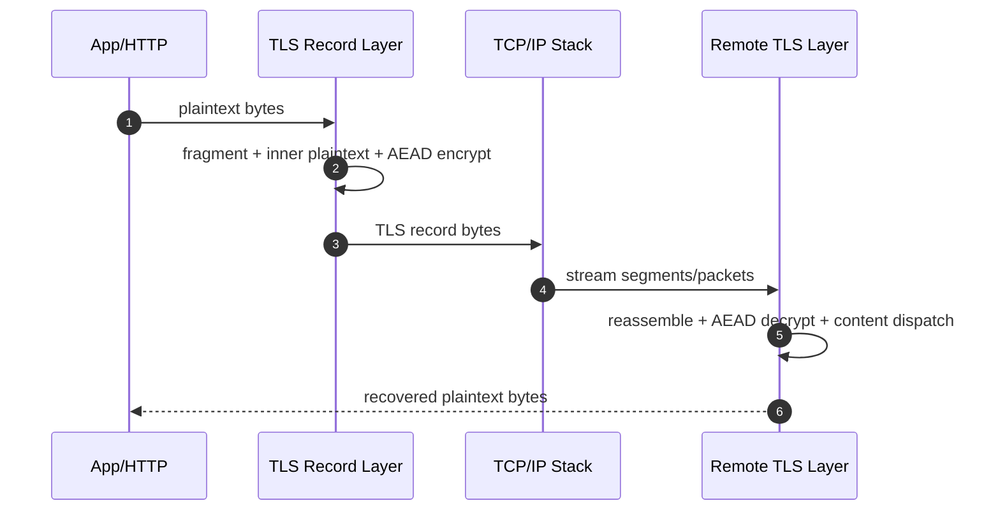
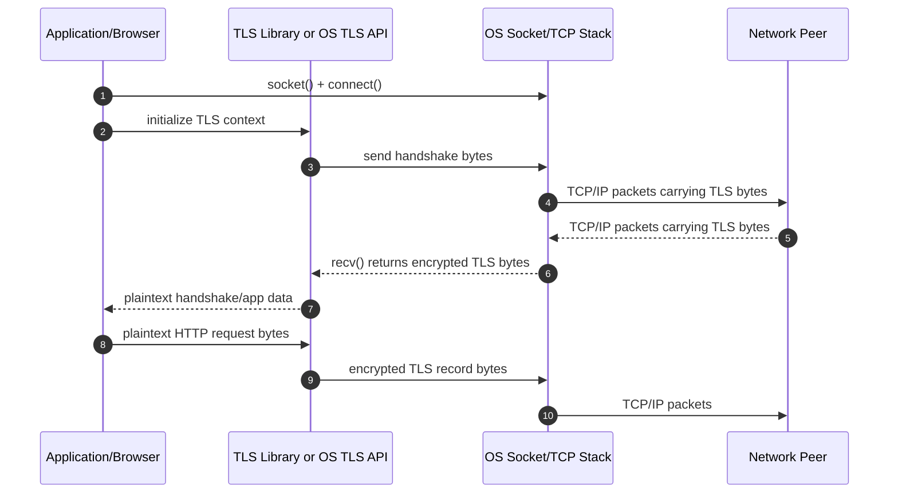

# TLS — Record Layer and Packet Mapping

TLS protects application data by transforming plaintext bytes into authenticated encrypted records and mapping those records onto transport packets.

## Layering (HTTPS over TCP)

`HTTP plaintext` -> `TLS record` -> `TCP segment` -> `IP packet` -> `Link frame`

Important boundary rule:

- HTTP message boundaries, TLS record boundaries, TCP segment boundaries, and IP packet boundaries are independent.
- Implementations must reassemble streams across boundaries before parsing upper-layer structures.

For troubleshooting, think in four nested containers:

1. HTTP bytes
2. TLS records
3. TCP byte stream / segments
4. IP packets

Each layer has its own framing rules and retransmission behavior.

## IP and TCP Header Fields Relevant to TLS Traffic

Even though TLS protects application data, packet captures still expose transport metadata.

Relevant IPv4 fields:

- source IP
- destination IP
- TTL
- protocol (`6` for TCP)
- total length

Relevant TCP fields:

- source port
- destination port (`443` for HTTPS over TCP)
- sequence number
- acknowledgment number
- flags (`SYN`, `ACK`, `PSH`, `FIN`, `RST`)
- window size
- options (MSS, SACK, timestamps)

Conceptual packet view:

```text
Ethernet frame
    IPv4 header
        src=client_ip, dst=server_ip, proto=TCP
    TCP header
        src_port=53144, dst_port=443, seq=1001, ack=5001, flags=PSH|ACK
    TLS record bytes
```

## C-Style Struct View of Packet Layers

```c
struct ipv4_header {
        uint8_t  version_ihl;
        uint8_t  dscp_ecn;
        uint16_t total_length;
        uint16_t identification;
        uint16_t flags_fragment_offset;
        uint8_t  ttl;
        uint8_t  protocol;
        uint16_t checksum;
        uint32_t src_ip;
        uint32_t dst_ip;
};

struct tcp_header {
        uint16_t src_port;
        uint16_t dst_port;
        uint32_t seq;
        uint32_t ack;
        uint8_t  data_offset;
        uint8_t  flags;
        uint16_t window;
        uint16_t checksum;
        uint16_t urgent_ptr;
};

struct tls_record_header {
        uint8_t  opaque_type;
        uint16_t legacy_record_version;
        uint16_t length;
};
```

## TLS 1.3 Record Format (Detailed)

TLSCiphertext on the wire uses a 5-byte header:

- `opaque_type` (1 byte): usually `application_data` (`23`) for TLS 1.3 encrypted records
- `legacy_record_version` (2 bytes): compatibility field (often `0x0303`)
- `length` (2 bytes): ciphertext length that follows

Conceptual on-wire view:

```text
struct TLSCiphertext {
    uint8  opaque_type;            // usually 23 = application_data
    uint16 legacy_record_version;  // usually 0x0303
    uint16 length;                 // bytes of ciphertext that follow
    uint8  encrypted_record[length];
}
```

Ciphertext payload contains encrypted bytes for:

- `TLSInnerPlaintext.content`
- Optional padding bytes
- `TLSInnerPlaintext.content_type` (for example handshake/application_data/alert)
- AEAD authentication tag

Conceptual decrypted inner layout:

```text
struct TLSInnerPlaintext {
        opaque content[T];
        ContentType type;
        uint8 zeros[length_of_padding];
}
```

## Handshake Packet Formats vs Application Packet Formats

Before application data starts, the payload inside records is handshake content.
After handshake completion, the payload inside records is application content.

Conceptual examples:

```text
Early handshake record:
TCP segment
    TLS record
        Handshake message bytes (ClientHello / ServerHello / ...)

Post-handshake HTTPS record:
TCP segment
    TLS record
        HTTP request or response bytes
```

From packet-capture perspective:

- IP/TCP headers are visible on the wire
- TLS record header fields are visible
- TLS encrypted payload contents are not visible without keys

## Example Byte-Flow During HTTPS Request

Conceptually, a browser sending an HTTPS request does this:

1. Build plaintext HTTP request bytes
2. Pass plaintext to TLS library
3. TLS library emits encrypted TLS record bytes
4. OS sends those bytes over TCP/IP

Conceptual flow:

```text
HTTP request bytes:
    "GET / HTTP/1.1\r\nHost: www.example.com\r\n..."

TLS layer output:
    [record header][ciphertext+tag]

TCP/IP output:
    [ip header][tcp header][tls record bytes]
```

## AEAD Nonce and Sequence Number Use

TLS 1.3 record protection uses AEAD (for example AES-GCM or ChaCha20-Poly1305).

Core inputs per record:

- Write key (direction-specific)
- Static IV (direction-specific)
- Record sequence number (monotonic counter)
- Additional authenticated data (record header fields)

Conceptual nonce derivation:

`per_record_nonce = static_iv XOR padded(sequence_number)`

## Send Path Deep Dive

### Step 1: Collect Plaintext Bytes

Source plaintext can be HTTP headers/body, HTTP/2 frames, or any application payload.

### Pseudo-Code: App to TLS Buffer

```python
def app_write(http_or_app_bytes, tls_state):
    tls_state.plaintext_buffer.extend(http_or_app_bytes)
```

### Step 2: Fragment into TLSInnerPlaintext Chunks

TLS splits data into bounded chunks (subject to record size policy and max fragment limits).

### Pseudo-Code: Fragmentation

```python
def fragment_plaintext(buf, max_fragment=16384):
    out = []
    i = 0
    while i < len(buf):
        out.append(buf[i:i + max_fragment])
        i += max_fragment
    return out
```

### Step 3: Build Inner Plaintext and Optional Padding

`TLSInnerPlaintext = content || type || padding`

### Pseudo-Code: Build Inner Plaintext

```python
def build_inner_plaintext(fragment, content_type, pad_len=0):
    inner = bytearray()
    inner.extend(fragment)
    inner.append(content_type)
    if pad_len > 0:
        inner.extend(b"\x00" * pad_len)
    return bytes(inner)
```

### Step 4: Encrypt with AEAD

### Pseudo-Code: Encrypt Record Payload

```python
def encrypt_record_payload(inner, write_key, static_iv, seq_num, header_aad):
    nonce = xor_nonce(static_iv, seq_num)
    ciphertext = aead_encrypt(
        key=write_key,
        nonce=nonce,
        plaintext=inner,
        aad=header_aad,
    )
    return ciphertext
```

### Step 5: Emit TLS Record Header + Ciphertext

### Pseudo-Code: Serialize TLS Record

```python
def serialize_tls_record(ciphertext):
    opaque_type = 23  # application_data
    legacy_record_version = b"\x03\x03"
    length = len(ciphertext).to_bytes(2, "big")
    return bytes([opaque_type]) + legacy_record_version + length + ciphertext
```

### Step 6: Write to TCP Stream

### Pseudo-Code: Send over TCP

```python
def send_tls_record(record_bytes, tcp_sock):
    tcp_sock.sendall(record_bytes)
```

## C-Style Pseudo-Code: User-Space TLS over OS TCP

This is the common browser/application pattern.

```c
int fd = socket(AF_INET, SOCK_STREAM, 0);
connect(fd, (struct sockaddr *)&server_addr, sizeof(server_addr));

tls_ctx_t *tls = tls_ctx_new();
tls_set_server_name(tls, "www.example.com");
tls_attach_fd(tls, fd);

while (!tls_handshake_complete(tls)) {
    uint8_t outbuf[16384];
    size_t outlen = tls_produce_handshake_bytes(tls, outbuf, sizeof(outbuf));
    if (outlen > 0) {
        send(fd, outbuf, outlen, 0);
    }

    uint8_t inbuf[16384];
    int n = recv(fd, inbuf, sizeof(inbuf), 0);
    if (n > 0) {
        tls_consume_network_bytes(tls, inbuf, (size_t)n);
    }
}

size_t enc_len = tls_encrypt_app_data(tls, req_bytes, req_len, outbuf, sizeof(outbuf));
send(fd, outbuf, enc_len, 0);

int n = recv(fd, inbuf, sizeof(inbuf), 0);
tls_consume_network_bytes(tls, inbuf, (size_t)n);
size_t plain_len = tls_read_plaintext(tls, app_buf, sizeof(app_buf));
```

The key point is that `recv()` returns encrypted TLS bytes from the OS socket layer; the TLS library turns those into plaintext for the application.

### C-Style Pseudo-Code: Browser Request Path

```c
int fd = socket(AF_INET, SOCK_STREAM, 0);
connect(fd, (struct sockaddr *)&server_addr, sizeof(server_addr));

SSL *ssl = SSL_new(client_ctx);
SSL_set_fd(ssl, fd);
SSL_set_tlsext_host_name(ssl, "www.example.com");
SSL_connect(ssl);

const char *req =
    "GET / HTTP/1.1\r\n"
    "Host: www.example.com\r\n"
    "Connection: close\r\n\r\n";

SSL_write(ssl, req, strlen(req));

char buf[8192];
int n = SSL_read(ssl, buf, sizeof(buf));
```

Interpretation:

- `SSL_write` takes plaintext request bytes
- TLS library encrypts them into records
- socket sends the encrypted bytes over TCP
- `SSL_read` eventually returns plaintext response bytes after decryption

## C-Style Pseudo-Code: Application Using OS TLS Interface

If the app relies on a platform TLS interface, the code often looks simpler because the TLS provider abstracts record handling.

```c
int fd = socket(AF_INET, SOCK_STREAM, 0);
connect(fd, (struct sockaddr *)&server_addr, sizeof(server_addr));

os_tls_session_t *sess = os_tls_session_create();
os_tls_session_set_socket(sess, fd);
os_tls_session_set_server_name(sess, "www.example.com");
os_tls_session_handshake(sess);

os_tls_session_write(sess, req_bytes, req_len);
int n = os_tls_session_read(sess, resp_buf, sizeof(resp_buf));
```

In this model:

- application still opens the socket
- platform TLS implementation may handle handshake and decryption internally
- application still receives plaintext bytes and must parse HTTP itself

### C-Style Pseudo-Code: OS TLS Read/Write Shape

```c
os_tls_session_handshake(sess);

os_tls_session_write(sess, req_bytes, req_len);   /* plaintext in */
int n = os_tls_session_read(sess, resp_buf, sizeof(resp_buf)); /* plaintext out */
```

Even here, there is still an encrypted transport path underneath. The difference is that the platform TLS layer hides record parsing from the application.

## Receive Path Deep Dive

### Step 1: Read Bytes and Reconstruct Record Header

TCP may return partial data; receiver must accumulate until header and full record bytes are available.

This is why applications cannot assume one `recv()` call equals one TLS record or one HTTP response.

### C-Style Pseudo-Code: Read Loop with Partial TLS Records

```c
uint8_t stream_buf[65536];
size_t stream_len = 0;

for (;;) {
    int n = recv(fd, stream_buf + stream_len, sizeof(stream_buf) - stream_len, 0);
    if (n <= 0) break;
    stream_len += (size_t)n;

    while (stream_len >= 5) {
        uint16_t rec_len = ((uint16_t)stream_buf[3] << 8) | stream_buf[4];
        if (stream_len < 5 + rec_len) break;

        tls_consume_one_record(tls, stream_buf, 5 + rec_len);
        memmove(stream_buf, stream_buf + 5 + rec_len, stream_len - (5 + rec_len));
        stream_len -= (5 + rec_len);
    }
}
```

### Pseudo-Code: Parse Framed Records from TCP Byte Stream

```python
def recv_one_tls_record(stream_buf, tcp_sock):
    while len(stream_buf) < 5:
        stream_buf.extend(tcp_sock.recv(4096))

    header = bytes(stream_buf[:5])
    length = int.from_bytes(header[3:5], "big")

    while len(stream_buf) < 5 + length:
        stream_buf.extend(tcp_sock.recv(4096))

    record = bytes(stream_buf[:5 + length])
    del stream_buf[:5 + length]
    return record
```

### Step 2: Verify and Decrypt Ciphertext

### Pseudo-Code: Decrypt Record

```python
def decrypt_tls_record(record, read_key, static_iv, seq_num):
    header = record[:5]
    ciphertext = record[5:]
    nonce = xor_nonce(static_iv, seq_num)
    inner = aead_decrypt(
        key=read_key,
        nonce=nonce,
        ciphertext=ciphertext,
        aad=header,
    )
    return inner
```

### Step 3: Strip Padding and Recover Inner Content Type

### Pseudo-Code: Parse Inner Plaintext

```python
def parse_inner_plaintext(inner):
    i = len(inner) - 1
    while i >= 0 and inner[i] == 0:
        i -= 1
    content_type = inner[i]
    content = inner[:i]
    return content_type, content
```

### Step 4: Dispatch by Recovered Content Type

Recovered type can be handshake, application data, or alert.

### Pseudo-Code: Content Dispatch

```python
def dispatch_tls_content(content_type, content, tls_state):
    if content_type == TLS_CONTENT_HANDSHAKE:
        handle_handshake_message(content, tls_state)
    elif content_type == TLS_CONTENT_APPLICATION_DATA:
        tls_state.plaintext_out.extend(content)
    elif content_type == TLS_CONTENT_ALERT:
        handle_alert(content, tls_state)
    else:
        raise TLSProtocolError("unknown inner content type")
```

## End-to-End Record Pipeline Pseudo-Code

```python
def send_https(http_bytes, tls_ctx, tcp_sock):
    fragments = fragment_plaintext(http_bytes, max_fragment=tls_ctx.max_fragment)
    for frag in fragments:
        inner = build_inner_plaintext(frag, content_type=TLS_CONTENT_APPLICATION_DATA)
        tmp_header = bytes([23]) + b"\x03\x03" + b"\x00\x00"
        ciphertext = encrypt_record_payload(
            inner,
            write_key=tls_ctx.write_key,
            static_iv=tls_ctx.write_iv,
            seq_num=tls_ctx.write_seq,
            header_aad=tmp_header,
        )
        record = serialize_tls_record(ciphertext)
        send_tls_record(record, tcp_sock)
        tls_ctx.write_seq += 1


def recv_https(tls_ctx, tcp_sock, stream_buf):
    record = recv_one_tls_record(stream_buf, tcp_sock)
    inner = decrypt_tls_record(
        record,
        read_key=tls_ctx.read_key,
        static_iv=tls_ctx.read_iv,
        seq_num=tls_ctx.read_seq,
    )
    tls_ctx.read_seq += 1

    content_type, content = parse_inner_plaintext(inner)
    dispatch_tls_content(content_type, content, tls_ctx)
    return bytes(tls_ctx.plaintext_out)
```

## Sequence Diagram: Record Lifecycle



## Sequence Diagram: OS Socket + TLS Library Interaction



## Packet Mapping Notes

1. One TLS record may span multiple TCP segments.
2. Multiple small TLS records may coalesce in one TCP segment.
3. TCP retransmission does not change TLS record semantics.
4. Flow-control/backpressure can delay record emission or receipt.

## What the OS Returns to the Application

There are two common cases:

1. User-space TLS library path:
- OS `recv()` returns encrypted TLS bytes.
- TLS library decrypts those bytes.
- Application gets plaintext from TLS API.

2. OS TLS API path:
- OS/socket layer still transports bytes.
- Platform TLS layer may return plaintext via its own read API.
- Application still parses HTTP/application protocol itself.

Conceptual contrast:

```text
Case A: app-managed TLS
    recv(fd) -> encrypted TLS bytes
    tls_read() -> plaintext HTTP bytes

Case B: platform TLS API
    os_tls_read(session) -> plaintext HTTP bytes
```

## Reverse Direction: How Encrypted Bytes Reach the App

For the receive path, the sequence is:

1. NIC receives Ethernet frame
2. Kernel network stack processes IP and TCP headers
3. Kernel appends TCP payload bytes to socket receive buffer
4. Application or TLS layer reads from socket/API
5. TLS layer decrypts and authenticates record
6. Application gets plaintext bytes

### C-Style Pseudo-Code: OS Socket to TLS Library to App

```c
int n = recv(fd, encrypted_buf, sizeof(encrypted_buf), 0);
if (n > 0) {
        tls_feed_network_bytes(tls, encrypted_buf, (size_t)n);
}

int plain_n = tls_read_plaintext(tls, plain_buf, sizeof(plain_buf));
if (plain_n > 0) {
        http_parser_consume(plain_buf, (size_t)plain_n);
}
```

This is the most common application-managed TLS model: OS returns encrypted bytes; TLS library returns plaintext bytes.

## Troubleshooting by Layer

### TLS Decryption Failures

- Likely causes: wrong key epoch, nonce/sequence mismatch, tampering, corrupted ciphertext.

### Pseudo-Code: Error Classification

```python
def classify_tls_failure(exc):
    if exc.code in ("BAD_RECORD_MAC", "DECRYPT_ERROR"):
        return "integrity_or_key_mismatch"
    if exc.code == "UNEXPECTED_MESSAGE":
        return "state_machine_violation"
    if exc.code == "RECORD_OVERFLOW":
        return "record_size_violation"
    return "unknown_tls_failure"
```

### TCP/Transport Symptoms That Mimic TLS Problems

- Connection reset mid-handshake or mid-record.
- Path MTU or middlebox behavior causing partial delivery patterns.
- Idle timeout closing sockets before full response is drained.

## Practical Debugging Checklist

1. Confirm handshake completion before expecting app data.
2. Verify record sequence counters advance consistently.
3. Confirm key updates/resumption epochs are synchronized.
4. Separate transport resets from TLS alerts in logs.
5. Correlate TLS alerts with application-layer failures.

---

**Navigation:**
- [<- Previous: TLS 1.3 Handshake Transcript](02-tls13-handshake-transcript.md)
- [Back to Index](README.md)
- [Next: OpenSSL in Modern Applications ->](04-openssl-in-modern-applications.md)
