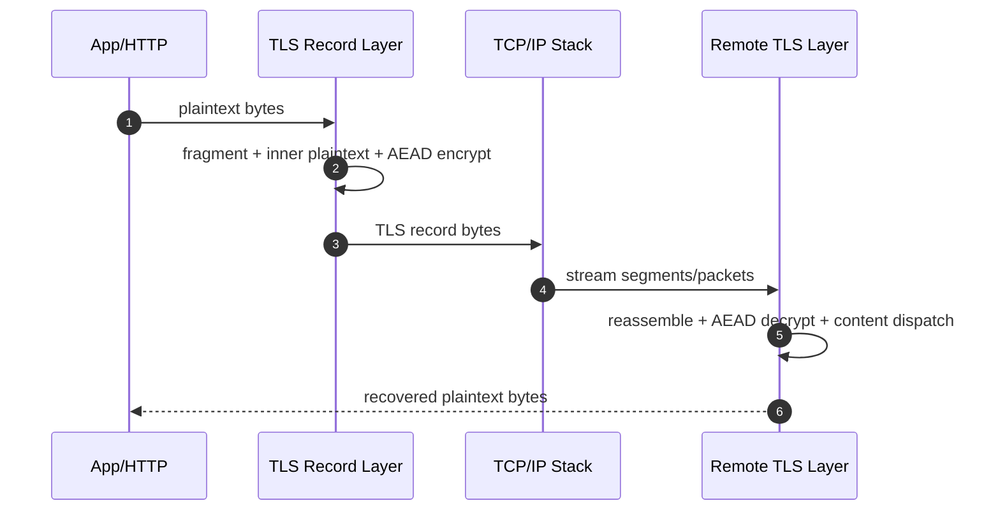

# TLS — Record Layer and Packet Mapping

TLS protects application data by transforming plaintext bytes into authenticated encrypted records and mapping those records onto transport packets.

## Layering (HTTPS over TCP)

`HTTP plaintext` -> `TLS record` -> `TCP segment` -> `IP packet` -> `Link frame`

Important boundary rule:

- HTTP message boundaries, TLS record boundaries, TCP segment boundaries, and IP packet boundaries are independent.
- Implementations must reassemble streams across boundaries before parsing upper-layer structures.

## TLS 1.3 Record Format (Detailed)

TLSCiphertext on the wire uses a 5-byte header:

- `opaque_type` (1 byte): usually `application_data` (`23`) for TLS 1.3 encrypted records
- `legacy_record_version` (2 bytes): compatibility field (often `0x0303`)
- `length` (2 bytes): ciphertext length that follows

Ciphertext payload contains encrypted bytes for:

- `TLSInnerPlaintext.content`
- Optional padding bytes
- `TLSInnerPlaintext.content_type` (for example handshake/application_data/alert)
- AEAD authentication tag

## AEAD Nonce and Sequence Number Use

TLS 1.3 record protection uses AEAD (for example AES-GCM or ChaCha20-Poly1305).

Core inputs per record:

- Write key (direction-specific)
- Static IV (direction-specific)
- Record sequence number (monotonic counter)
- Additional authenticated data (record header fields)

Conceptual nonce derivation:

`per_record_nonce = static_iv XOR padded(sequence_number)`

## Send Path Deep Dive

### Step 1: Collect Plaintext Bytes

Source plaintext can be HTTP headers/body, HTTP/2 frames, or any application payload.

### Pseudo-Code: App to TLS Buffer

```python
def app_write(http_or_app_bytes, tls_state):
    tls_state.plaintext_buffer.extend(http_or_app_bytes)
```

### Step 2: Fragment into TLSInnerPlaintext Chunks

TLS splits data into bounded chunks (subject to record size policy and max fragment limits).

### Pseudo-Code: Fragmentation

```python
def fragment_plaintext(buf, max_fragment=16384):
    out = []
    i = 0
    while i < len(buf):
        out.append(buf[i:i + max_fragment])
        i += max_fragment
    return out
```

### Step 3: Build Inner Plaintext and Optional Padding

`TLSInnerPlaintext = content || type || padding`

### Pseudo-Code: Build Inner Plaintext

```python
def build_inner_plaintext(fragment, content_type, pad_len=0):
    inner = bytearray()
    inner.extend(fragment)
    inner.append(content_type)
    if pad_len > 0:
        inner.extend(b"\x00" * pad_len)
    return bytes(inner)
```

### Step 4: Encrypt with AEAD

### Pseudo-Code: Encrypt Record Payload

```python
def encrypt_record_payload(inner, write_key, static_iv, seq_num, header_aad):
    nonce = xor_nonce(static_iv, seq_num)
    ciphertext = aead_encrypt(
        key=write_key,
        nonce=nonce,
        plaintext=inner,
        aad=header_aad,
    )
    return ciphertext
```

### Step 5: Emit TLS Record Header + Ciphertext

### Pseudo-Code: Serialize TLS Record

```python
def serialize_tls_record(ciphertext):
    opaque_type = 23  # application_data
    legacy_record_version = b"\x03\x03"
    length = len(ciphertext).to_bytes(2, "big")
    return bytes([opaque_type]) + legacy_record_version + length + ciphertext
```

### Step 6: Write to TCP Stream

### Pseudo-Code: Send over TCP

```python
def send_tls_record(record_bytes, tcp_sock):
    tcp_sock.sendall(record_bytes)
```

## Receive Path Deep Dive

### Step 1: Read Bytes and Reconstruct Record Header

TCP may return partial data; receiver must accumulate until header and full record bytes are available.

### Pseudo-Code: Parse Framed Records from TCP Byte Stream

```python
def recv_one_tls_record(stream_buf, tcp_sock):
    while len(stream_buf) < 5:
        stream_buf.extend(tcp_sock.recv(4096))

    header = bytes(stream_buf[:5])
    length = int.from_bytes(header[3:5], "big")

    while len(stream_buf) < 5 + length:
        stream_buf.extend(tcp_sock.recv(4096))

    record = bytes(stream_buf[:5 + length])
    del stream_buf[:5 + length]
    return record
```

### Step 2: Verify and Decrypt Ciphertext

### Pseudo-Code: Decrypt Record

```python
def decrypt_tls_record(record, read_key, static_iv, seq_num):
    header = record[:5]
    ciphertext = record[5:]
    nonce = xor_nonce(static_iv, seq_num)
    inner = aead_decrypt(
        key=read_key,
        nonce=nonce,
        ciphertext=ciphertext,
        aad=header,
    )
    return inner
```

### Step 3: Strip Padding and Recover Inner Content Type

### Pseudo-Code: Parse Inner Plaintext

```python
def parse_inner_plaintext(inner):
    i = len(inner) - 1
    while i >= 0 and inner[i] == 0:
        i -= 1
    content_type = inner[i]
    content = inner[:i]
    return content_type, content
```

### Step 4: Dispatch by Recovered Content Type

Recovered type can be handshake, application data, or alert.

### Pseudo-Code: Content Dispatch

```python
def dispatch_tls_content(content_type, content, tls_state):
    if content_type == TLS_CONTENT_HANDSHAKE:
        handle_handshake_message(content, tls_state)
    elif content_type == TLS_CONTENT_APPLICATION_DATA:
        tls_state.plaintext_out.extend(content)
    elif content_type == TLS_CONTENT_ALERT:
        handle_alert(content, tls_state)
    else:
        raise TLSProtocolError("unknown inner content type")
```

## End-to-End Record Pipeline Pseudo-Code

```python
def send_https(http_bytes, tls_ctx, tcp_sock):
    fragments = fragment_plaintext(http_bytes, max_fragment=tls_ctx.max_fragment)
    for frag in fragments:
        inner = build_inner_plaintext(frag, content_type=TLS_CONTENT_APPLICATION_DATA)
        tmp_header = bytes([23]) + b"\x03\x03" + b"\x00\x00"
        ciphertext = encrypt_record_payload(
            inner,
            write_key=tls_ctx.write_key,
            static_iv=tls_ctx.write_iv,
            seq_num=tls_ctx.write_seq,
            header_aad=tmp_header,
        )
        record = serialize_tls_record(ciphertext)
        send_tls_record(record, tcp_sock)
        tls_ctx.write_seq += 1


def recv_https(tls_ctx, tcp_sock, stream_buf):
    record = recv_one_tls_record(stream_buf, tcp_sock)
    inner = decrypt_tls_record(
        record,
        read_key=tls_ctx.read_key,
        static_iv=tls_ctx.read_iv,
        seq_num=tls_ctx.read_seq,
    )
    tls_ctx.read_seq += 1

    content_type, content = parse_inner_plaintext(inner)
    dispatch_tls_content(content_type, content, tls_ctx)
    return bytes(tls_ctx.plaintext_out)
```

## Sequence Diagram: Record Lifecycle



## Packet Mapping Notes

1. One TLS record may span multiple TCP segments.
2. Multiple small TLS records may coalesce in one TCP segment.
3. TCP retransmission does not change TLS record semantics.
4. Flow-control/backpressure can delay record emission or receipt.

## Troubleshooting by Layer

### TLS Decryption Failures

- Likely causes: wrong key epoch, nonce/sequence mismatch, tampering, corrupted ciphertext.

### Pseudo-Code: Error Classification

```python
def classify_tls_failure(exc):
    if exc.code in ("BAD_RECORD_MAC", "DECRYPT_ERROR"):
        return "integrity_or_key_mismatch"
    if exc.code == "UNEXPECTED_MESSAGE":
        return "state_machine_violation"
    if exc.code == "RECORD_OVERFLOW":
        return "record_size_violation"
    return "unknown_tls_failure"
```

### TCP/Transport Symptoms That Mimic TLS Problems

- Connection reset mid-handshake or mid-record.
- Path MTU or middlebox behavior causing partial delivery patterns.
- Idle timeout closing sockets before full response is drained.

## Practical Debugging Checklist

1. Confirm handshake completion before expecting app data.
2. Verify record sequence counters advance consistently.
3. Confirm key updates/resumption epochs are synchronized.
4. Separate transport resets from TLS alerts in logs.
5. Correlate TLS alerts with application-layer failures.

---

**Navigation:**
- [<- Previous: TLS 1.3 Handshake Transcript](02-tls13-handshake-transcript.md)
- [Back to Index](README.md)
